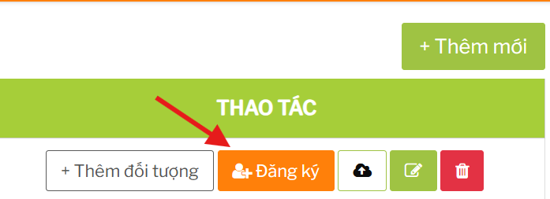
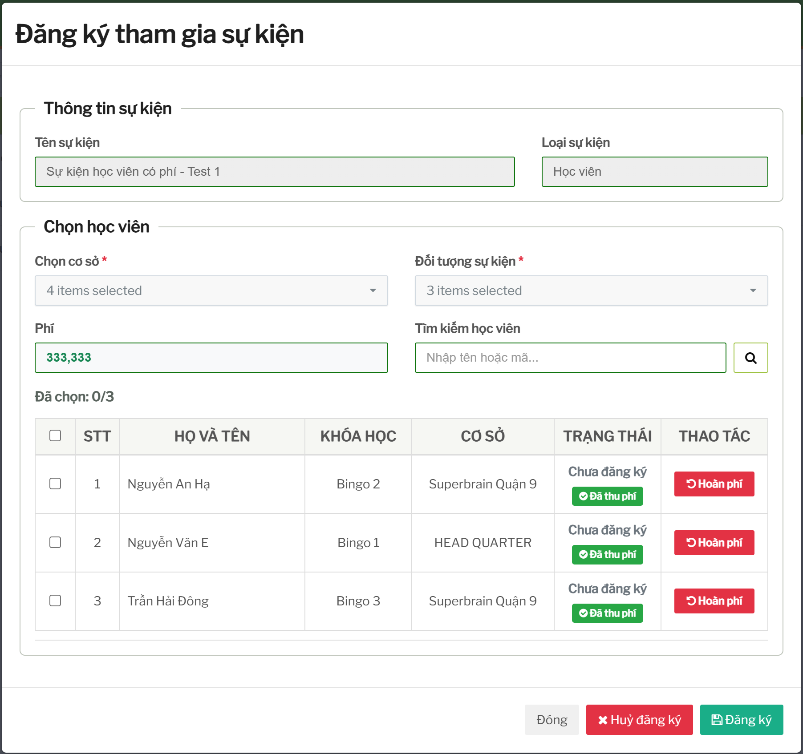
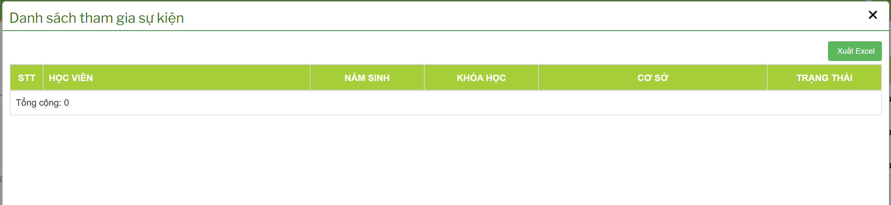
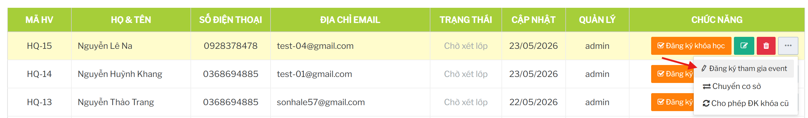

# Đăng ký người tham gia sự kiện

## Tính năng dùng để làm gì

Tính năng này dùng để tìm người đủ điều kiện tham gia sự kiện, chọn người tham gia và lưu đăng ký. Người tham gia có thể là học viên hoặc giáo viên tùy loại sự kiện.

## Điều kiện để đăng ký

Sự kiện phải đang còn hiệu lực và còn trong hạn đăng ký.

Sự kiện phải có cấu hình đối tượng áp dụng. Nếu chưa có đối tượng áp dụng, danh sách người đủ điều kiện có thể trống.

Người tham gia phải thỏa điều kiện đã cấu hình:

- đúng chi nhánh được áp dụng
- đúng độ tuổi hoặc khóa học nếu là học viên
- đúng khóa tập huấn nếu là giáo viên
- chưa bị loại khỏi điều kiện nghiệp vụ hiện tại

Với sự kiện có phí, người tham gia cần có phiếu thu hợp lệ trước khi đăng ký được tính là hoàn tất.

## Quy trình đăng ký từ màn Sự kiện

1. Mở danh sách sự kiện.
2. Chọn sự kiện cần đăng ký.
3. Chọn chi nhánh và nhóm đối tượng áp dụng.
4. Tải danh sách người đủ điều kiện.
5. Chọn học viên/giáo viên cần đăng ký.
6. Lưu đăng ký.
7. Kiểm tra lại số lượng hoặc mở danh sách người đã đăng ký.

## Quy trình đăng ký từ hồ sơ học viên

Một số màn học viên có thể mở đăng ký sự kiện trực tiếp cho học viên. Cách này thuận tiện khi đang thao tác trên hồ sơ học viên, nhưng nên ưu tiên kiểm tra lại danh sách ở màn Sự kiện để đảm bảo dữ liệu đăng ký đúng.

## Khi danh sách người đủ điều kiện bị trống

Kiểm tra lần lượt:

- sự kiện đã có đối tượng áp dụng chưa
- đã chọn đúng chi nhánh chưa
- học viên có thuộc khóa học/độ tuổi được cấu hình không
- giáo viên có thuộc khóa tập huấn được cấu hình không
- sự kiện còn hạn đăng ký không
- tài khoản hiện tại có quyền xem chi nhánh đó không

## Hủy đăng ký

Có thể hủy đăng ký khi người tham gia không còn tham gia sự kiện.

Với sự kiện miễn phí, hủy đăng ký chủ yếu ảnh hưởng danh sách người tham gia.

Với sự kiện có phí, hủy đăng ký có thể làm phiếu thu không còn được dùng cho đăng ký đó. Nếu cần trả tiền lại cho người tham gia, phải thực hiện thêm bước hoàn phí.

## Ảnh hưởng đến tính năng khác

| Thao tác | Ảnh hưởng |
| --- | --- |
| Đăng ký học viên | Ảnh hưởng hồ sơ học viên, số lượng tham gia sự kiện và báo cáo sự kiện. |
| Đăng ký giáo viên | Ảnh hưởng dữ liệu giáo viên/nhân sự tham gia sự kiện. |
| Đăng ký sự kiện có phí | Liên kết với phiếu thu sự kiện và dữ liệu kế toán. |
| Hủy đăng ký | Giảm số người tham gia; với event có phí cần kiểm tra trạng thái thu/hoàn phí. |
| Chọn sai đối tượng | Có thể đăng ký thiếu hoặc nhầm người tham gia. |

## Checklist trước khi đăng ký

- Đúng sự kiện.
- Đúng chi nhánh.
- Đúng nhóm đối tượng.
- Người tham gia nằm trong danh sách đủ điều kiện.
- Với sự kiện có phí, đã thu phí đúng người.
- Sau khi lưu, số lượng người đăng ký thay đổi đúng.
