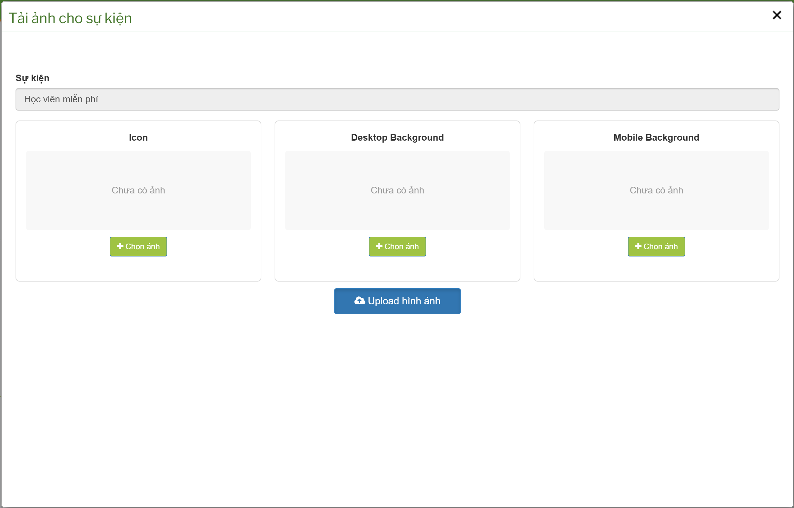
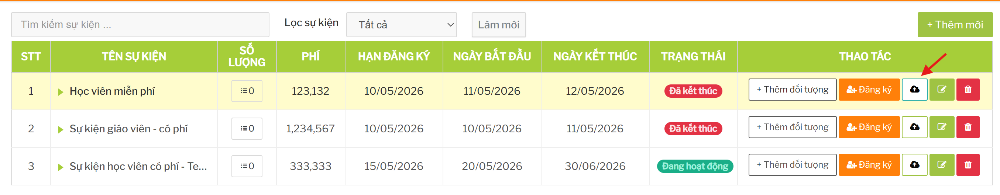
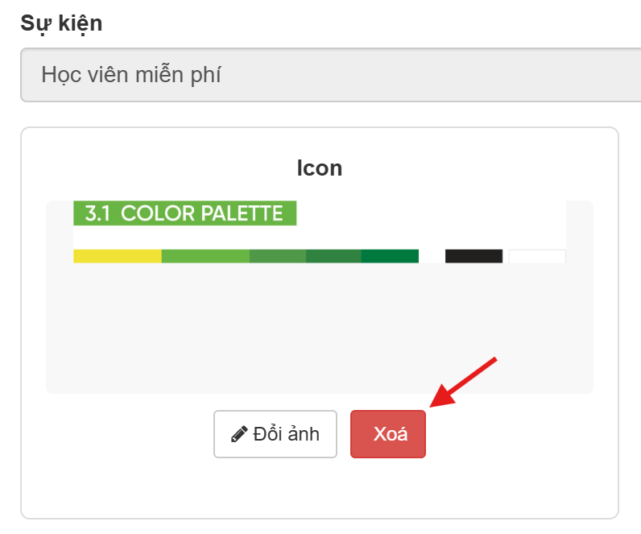

# Hình ảnh hiển thị sự kiện

## Tính năng dùng để làm gì

Tính năng này dùng để cập nhật hình ảnh cho sự kiện, gồm:

- icon sự kiện
- ảnh nền desktop
- ảnh nền mobile

Hình ảnh giúp sự kiện dễ nhận diện hơn khi hiển thị trên giao diện.

## Điều kiện để upload ảnh

Người dùng cần có quyền quản lý sự kiện.

Sự kiện cần đã được tạo trước khi upload ảnh.

Nên chuẩn bị ảnh đúng kích thước và đúng nội dung truyền thông. Nếu dùng ảnh sai tỷ lệ, giao diện có thể bị xấu hoặc cắt ảnh không như mong muốn.

## Lưu ý khi chọn ảnh

- Không dùng ảnh chứa thông tin sai ngày, sai phí hoặc sai điều kiện tham gia.
- Không dùng ảnh quá nặng vì có thể làm trang tải chậm.
- Nên chuẩn bị riêng ảnh desktop và mobile nếu bố cục khác nhau.
- Tránh dùng ảnh có chữ quá nhỏ trên mobile.
- Nếu thay ảnh sự kiện đang chạy, nên kiểm tra lại giao diện sau khi lưu.

## Xóa ảnh

Chỉ xóa ảnh khi:

- ảnh sai
- cần thay ảnh mới
- sự kiện không còn cần hình ảnh đó

Sau khi xóa, sự kiện có thể hiển thị thiếu ảnh ở một số vị trí.

## Ảnh hưởng đến tính năng khác

| Thao tác | Ảnh hưởng |
| --- | --- |
| Upload icon | Ảnh hưởng cách sự kiện hiển thị trong danh sách/thẻ sự kiện nếu có dùng icon. |
| Upload background desktop | Ảnh hưởng giao diện trên máy tính. |
| Upload background mobile | Ảnh hưởng giao diện trên điện thoại. |
| Xóa ảnh | Có thể làm sự kiện hiển thị trống ảnh hoặc dùng ảnh mặc định. |

## Checklist trước khi lưu ảnh

- Đúng sự kiện.
- Ảnh đúng nội dung.
- Ảnh không chứa thông tin lỗi thời.
- Ảnh đủ rõ trên desktop/mobile.
- Dung lượng ảnh hợp lý.
