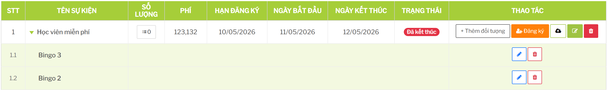
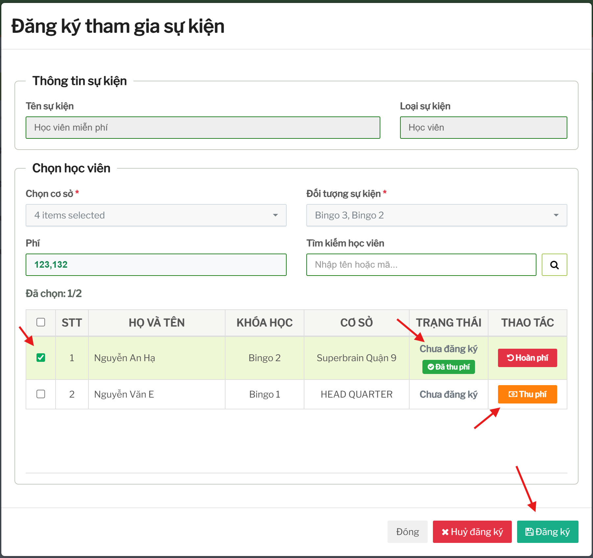

# Lưu ý vận hành module Sự kiện

## Nguyên tắc thao tác

Không sửa trực tiếp dữ liệu sự kiện qua database nếu chưa hiểu ảnh hưởng đến đăng ký, phiếu thu và hoàn phí.

## Các lỗi thường gặp

### Không thấy học viên/giáo viên trong danh sách đủ điều kiện

Kiểm tra:

- đã chọn đúng loại sự kiện chưa
- đã cấu hình đối tượng áp dụng chưa
- đã chọn đúng chi nhánh chưa
- học viên/giáo viên có thuộc điều kiện đã cấu hình không
- sự kiện còn hạn đăng ký không

### Đã thu phí nhưng chưa thấy người tham gia trong danh sách đăng ký

Với sự kiện có phí, thu phí chưa chắc đã là đăng ký hoàn tất. Cần thực hiện bước đăng ký để phiếu thu được dùng cho người tham gia.

### Không thể đổi phí sự kiện

Nếu sự kiện đã có đăng ký hoặc phiếu thu, hệ thống có thể chặn đổi phí để tránh sai lệch kế toán. Cần xử lý đăng ký/thu phí liên quan trước hoặc tạo sự kiện mới nếu nghiệp vụ phù hợp hơn.

### Hủy đăng ký nhưng tiền vẫn còn ghi nhận

Hủy đăng ký không đồng nghĩa với hoàn phí. Nếu cần trả tiền, phải thực hiện thêm bước hoàn phí.

### Số lượng người tham gia không như mong đợi

Kiểm tra event miễn phí hay có phí:

- miễn phí: thường đếm theo đăng ký
- có phí: có thể phụ thuộc phiếu thu đã được dùng cho đăng ký

## Checklist trước khi mở đăng ký sự kiện

- Sự kiện đã có tên, thời gian, hạn đăng ký.
- Đã chọn đúng loại học viên/giáo viên.
- Đã cấu hình đối tượng áp dụng.
- Đã cấu hình chi nhánh áp dụng.
- Phí đã thống nhất với kế toán nếu có phí.
- Hình ảnh/nội dung truyền thông đã đúng.
- Đã thử lọc danh sách người đủ điều kiện.

## Checklist sau khi kết thúc sự kiện

- Xuất hoặc kiểm tra danh sách người đã đăng ký.
- Đối chiếu phí đã thu/hoàn nếu là sự kiện có phí.
- Kiểm tra còn phiếu thu chưa được dùng cho đăng ký hay không.
- Không xóa sự kiện nếu còn cần đối chiếu dữ liệu.

## Ảnh hưởng dữ liệu cần nhớ

| Dữ liệu | Vì sao quan trọng |
| --- | --- |
| Đối tượng áp dụng | Quyết định ai được đăng ký. |
| Hạn đăng ký | Quyết định thời điểm còn được thao tác đăng ký/thu phí. |
| Phí sự kiện | Ảnh hưởng phiếu thu, hoàn phí và báo cáo kế toán. |
| Chi nhánh áp dụng | Ảnh hưởng user nào thấy/chọn được người tham gia. |
| Danh sách đăng ký | Dùng để thống kê, đối chiếu và tổ chức sự kiện. |
