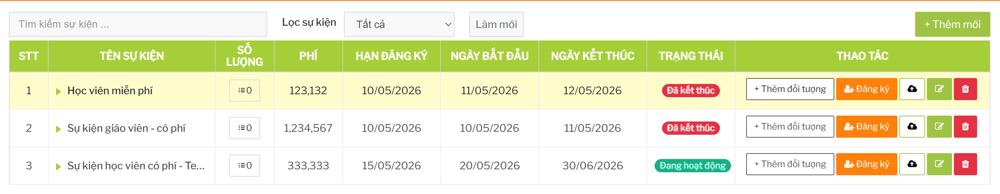

# Sổ tay người dùng: Sự kiện

## Mục đích

Module Sự kiện dùng để tạo và quản lý các chương trình/sự kiện dành cho học viên hoặc giáo viên. Người dùng có thể:

- tạo sự kiện mới
- cấu hình đối tượng được tham gia
- đăng ký học viên hoặc giáo viên vào sự kiện
- thu phí hoặc hoàn phí nếu sự kiện có phí
- xem danh sách người đã đăng ký
- cập nhật hình ảnh hiển thị của sự kiện

Đường dẫn sử dụng chính:

```text
Sự kiện -> Danh sách sự kiện
```

## Khi nào dùng module này

Dùng module Sự kiện khi trung tâm cần quản lý một chương trình có danh sách người tham gia riêng, có thể cần lọc theo chi nhánh, khóa học, độ tuổi hoặc khóa tập huấn.

Ví dụ:

- sự kiện cho học viên một nhóm tuổi cụ thể
- sự kiện chỉ dành cho học viên đang học một số khóa nhất định
- sự kiện dành cho giáo viên đã tham gia khóa tập huấn
- sự kiện có phí cần ghi nhận thu/hoàn phí



## Điều kiện chung để sử dụng

Người dùng cần có quyền truy cập module Sự kiện. Nếu không thấy menu hoặc không vào được màn, cần kiểm tra phân quyền tài khoản.

Trước khi tạo sự kiện cần chuẩn bị:

- tên sự kiện
- mô tả/thể lệ
- loại người tham gia: học viên hoặc giáo viên
- thời gian bắt đầu/kết thúc
- hạn đăng ký
- phí tham gia nếu có
- số lượng hoặc giới hạn tham gia nếu nghiệp vụ yêu cầu
- nhóm đối tượng áp dụng
- chi nhánh được áp dụng
- hình ảnh hiển thị nếu sự kiện cần truyền thông nội bộ

## Những điểm cần hiểu trước khi thao tác

Mỗi sự kiện cần có ít nhất một nhóm đối tượng áp dụng. Nếu chỉ tạo sự kiện nhưng chưa cấu hình đối tượng, người dùng có thể không tìm được học viên/giáo viên đủ điều kiện để đăng ký.

Sự kiện miễn phí và sự kiện có phí có cách xử lý khác nhau:

- sự kiện miễn phí: đăng ký trực tiếp người tham gia
- sự kiện có phí: cần thu phí trước, sau đó phiếu thu được dùng để xác nhận đăng ký

Không nên thay đổi phí sự kiện sau khi đã có người đăng ký hoặc đã có phiếu thu. Hệ thống có thể chặn một số trường hợp để tránh lệch dữ liệu kế toán.

## Ảnh hưởng đến module khác

| Module/tính năng | Ảnh hưởng |
| --- | --- |
| Học viên | Dùng danh sách học viên, khóa học đang học và chi nhánh để lọc người đủ điều kiện. |
| Nhân sự/Giáo viên | Dùng hồ sơ giáo viên và khóa tập huấn để lọc người đủ điều kiện. |
| Kế toán/Thu chi | Khi thu phí hoặc hoàn phí sự kiện, hệ thống tạo phiếu thu/chi liên quan. |
| Chi nhánh | Quyết định user nhìn thấy hoặc chọn được người tham gia thuộc chi nhánh nào. |

## Tài liệu con

- [QuanLySuKien.md](./QuanLySuKien.md): tạo, sửa, xóa mềm và cấu hình đối tượng sự kiện.
- [DangKyNguoiThamGia.md](./DangKyNguoiThamGia.md): lọc, đăng ký, hủy đăng ký và xem danh sách tham gia.
- [ThuHoanPhi.md](./ThuHoanPhi.md): thu phí, hoàn phí và các điều kiện tài chính.
- [HinhAnhHienThi.md](./HinhAnhHienThi.md): upload icon, background desktop/mobile.
- [LuuYVanHanh.md](./LuuYVanHanh.md): lưu ý vận hành, lỗi thường gặp và checklist trước khi sửa dữ liệu.
