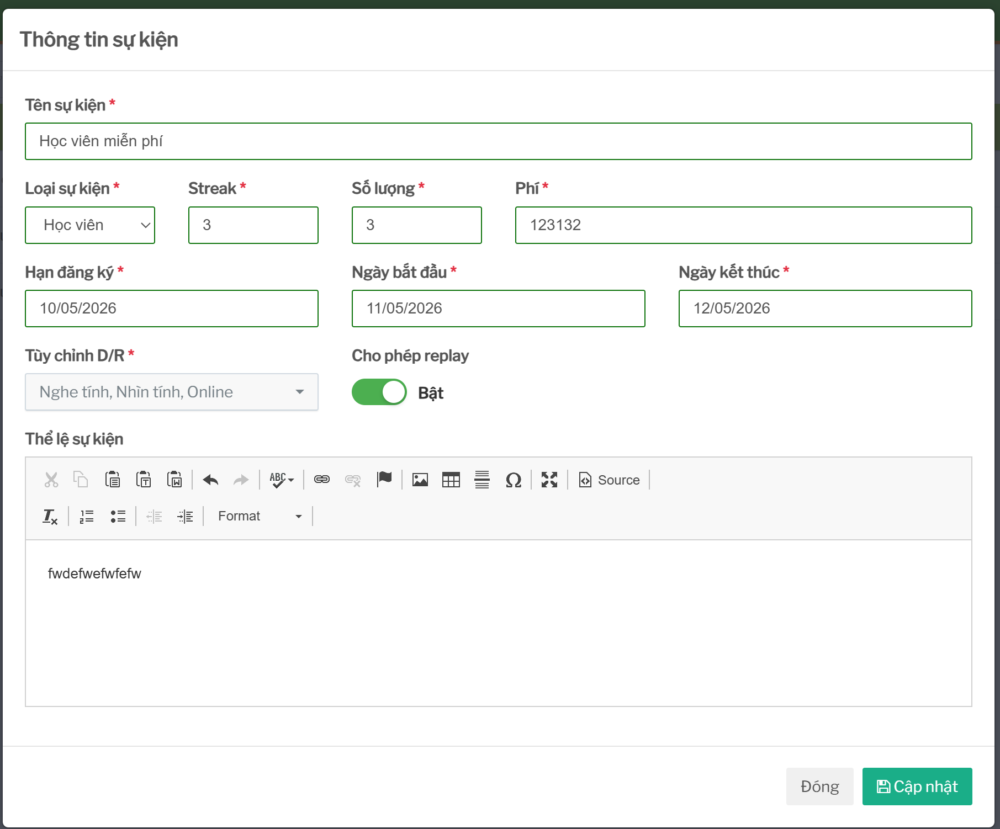
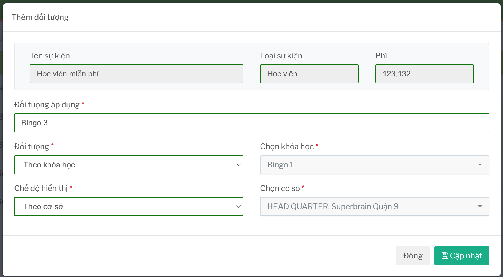

# Quản lý sự kiện

## Tính năng dùng để làm gì

Tính năng này dùng để tạo mới, chỉnh sửa, xóa mềm sự kiện và cấu hình các nhóm đối tượng được phép tham gia.

Một sự kiện đầy đủ thường gồm hai phần:

- thông tin chung của sự kiện
- nhóm đối tượng áp dụng

## Điều kiện để tạo sự kiện

Người dùng cần có quyền quản lý sự kiện.

Cần chuẩn bị trước:

- tên sự kiện
- loại người tham gia: học viên hoặc giáo viên
- thời gian diễn ra
- hạn đăng ký
- phí tham gia, nếu có
- mô tả/thể lệ
- nhóm đối tượng áp dụng
- chi nhánh được áp dụng

Nếu chưa biết chính xác đối tượng tham gia, nên thống nhất nghiệp vụ trước khi tạo để tránh tạo sự kiện hiển thị nhưng không đăng ký được.

## Các thông tin quan trọng

| Thông tin | Ý nghĩa |
| --- | --- |
| Loại sự kiện | Xác định danh sách người tham gia là học viên hay giáo viên. |
| Hạn đăng ký | Sau thời điểm này người dùng có thể không đăng ký/thu phí được nữa. |
| Phí | `0` là miễn phí; lớn hơn `0` là sự kiện có phí. |
| Đối tượng áp dụng | Điều kiện để hệ thống lọc người đủ điều kiện. |
| Chi nhánh áp dụng | Quyết định chi nhánh nào có thể thấy hoặc đăng ký người tham gia. |

## Cấu hình đối tượng áp dụng

Đối tượng áp dụng là điều kiện để hệ thống lọc người tham gia.

Với sự kiện dành cho học viên, có thể lọc theo:

- độ tuổi
- khóa học học viên đang học
- chi nhánh

Với sự kiện dành cho giáo viên, có thể lọc theo:

- khóa tập huấn
- chi nhánh

Nếu cấu hình đối tượng sai, danh sách người đủ điều kiện sẽ sai. Ví dụ, chọn nhầm khóa học có thể làm học viên cần đăng ký không xuất hiện.

## Điều kiện để sửa sự kiện

Có thể sửa thông tin sự kiện khi chưa phát sinh dữ liệu nhạy cảm.

Cần đặc biệt cẩn trọng khi sửa:

- loại sự kiện
- phí
- hạn đăng ký
- đối tượng áp dụng
- chi nhánh áp dụng

Nếu sự kiện đã có người đăng ký hoặc đã có phiếu thu, không nên đổi phí hoặc loại người tham gia. Việc này có thể làm sai số lượng đăng ký, trạng thái thu phí hoặc báo cáo kế toán.

## Điều kiện để xóa sự kiện

Chỉ nên xóa sự kiện khi:

- chưa có người đăng ký
- chưa có phiếu thu/hoàn phí liên quan
- không còn cần hiển thị trên danh sách

Nếu sự kiện đã phát sinh đăng ký hoặc thu phí, nên trao đổi với người phụ trách vận hành/kế toán trước khi xóa.

## Ảnh hưởng đến tính năng khác

| Thao tác | Ảnh hưởng |
| --- | --- |
| Tạo sự kiện | Tạo dữ liệu để người dùng có thể đăng ký học viên/giáo viên. |
| Sửa hạn đăng ký | Có thể làm người dùng không đăng ký/thu phí được nữa. |
| Sửa phí | Ảnh hưởng trực tiếp tới thu phí, hoàn phí và phiếu thu kế toán. |
| Sửa đối tượng áp dụng | Thay đổi danh sách người đủ điều kiện. |
| Xóa sự kiện | Có thể làm mất đường vào danh sách đăng ký hoặc dữ liệu đối chiếu. |

## Checklist trước khi lưu

- Đã chọn đúng loại học viên/giáo viên.
- Hạn đăng ký đúng với chính sách vận hành.
- Phí đúng và đã thống nhất với kế toán nếu là sự kiện có phí.
- Đối tượng áp dụng đúng khóa học/độ tuổi/khóa tập huấn.
- Chi nhánh áp dụng đúng.
- Nội dung mô tả không nhầm ngày, phí hoặc điều kiện tham gia.
