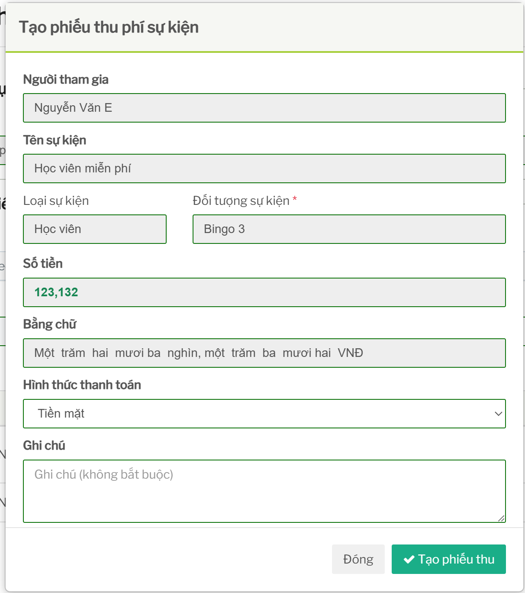
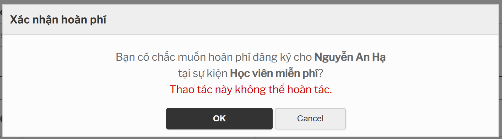

# Thu phí và hoàn phí sự kiện

## Tính năng dùng để làm gì

Tính năng này dùng để ghi nhận tiền thu từ người tham gia sự kiện có phí và xử lý hoàn phí khi người tham gia không tiếp tục tham gia hoặc cần trả lại tiền.

## Khi nào cần thu phí

Chỉ cần thu phí khi sự kiện có phí lớn hơn `0`.

Với sự kiện miễn phí, người dùng chỉ cần đăng ký người tham gia, không cần tạo phiếu thu.

## Điều kiện để thu phí

Trước khi thu phí cần đảm bảo:

- sự kiện là sự kiện có phí
- sự kiện còn trong hạn đăng ký/thu phí
- người được thu phí thỏa điều kiện tham gia
- người đó chưa có phiếu thu active cho cùng sự kiện
- số tiền thu đúng với phí sự kiện hiện tại
- chi nhánh ghi nhận đúng

Sau khi thu phí, phiếu thu sẽ liên quan đến dữ liệu kế toán/thu chi. Vì vậy không nên tạo thử phiếu thu trên dữ liệu thật.

## Quan hệ giữa thu phí và đăng ký

Với sự kiện có phí, thu phí và đăng ký là hai bước có liên quan:

1. Thu phí tạo phiếu thu.
2. Khi đăng ký người tham gia, phiếu thu đó được dùng để xác nhận người tham gia đã hoàn tất điều kiện phí.

Nếu chỉ thu phí nhưng chưa đăng ký, người đó có thể chưa được tính là người đã tham gia sự kiện.

Nếu đã đăng ký nhưng sau đó hủy đăng ký, cần kiểm tra có cần hoàn phí hay không.

## Điều kiện để hoàn phí

Chỉ nên hoàn phí khi:

- đã có phiếu thu hợp lệ
- người tham gia cần được trả lại tiền
- đã thống nhất với kế toán hoặc người phụ trách vận hành
- hoàn phí đúng người, đúng sự kiện, đúng số tiền

Hoàn phí sẽ tạo dữ liệu phiếu chi/hoàn tiền liên quan đến kế toán.

## Những trường hợp cần cẩn trọng

- Thu phí nhầm người.
- Thu phí nhầm chi nhánh.
- Đăng ký sai người sau khi đã thu phí.
- Hủy đăng ký nhưng quên hoàn phí.
- Hoàn phí nhưng người tham gia vẫn còn trong danh sách đăng ký.
- Sửa phí sự kiện sau khi đã có phiếu thu.

## Ảnh hưởng đến tính năng khác

| Thao tác | Ảnh hưởng |
| --- | --- |
| Thu phí | Tạo phiếu thu trong dữ liệu kế toán/thu chi. |
| Đăng ký sau thu phí | Phiếu thu được liên kết với đăng ký tham gia. |
| Hủy đăng ký | Có thể cần kiểm tra phiếu thu còn được dùng hay không. |
| Hoàn phí | Tạo phiếu chi/hoàn tiền và thay đổi trạng thái thanh toán. |
| Sửa phí sự kiện | Có thể ảnh hưởng phiếu thu đã tạo và báo cáo kế toán. |

## Checklist trước khi thu phí

- Đúng sự kiện.
- Đúng người tham gia.
- Đúng chi nhánh.
- Đúng số tiền.
- Người tham gia đủ điều kiện.
- Chưa có phiếu thu active trước đó.

## Checklist trước khi hoàn phí

- Đúng phiếu thu cần hoàn.
- Đúng người tham gia.
- Đã xác nhận người tham gia không còn cần giữ chỗ hoặc cần trả tiền.
- Kế toán/người phụ trách đã đồng ý.
- Sau hoàn phí, kiểm tra lại danh sách đăng ký và trạng thái phí.
