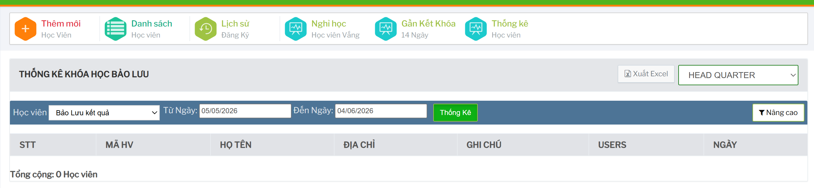

# Bảo lưu và trạng thái khóa học

## Tính năng dùng để làm gì

Nhóm thao tác này dùng để xử lý trạng thái khóa học của học viên: bảo lưu, gia hạn, kích hoạt lại, chuyển khóa, chuyển lớp, hủy khóa hoặc kết thúc sớm.

Các thao tác thường xuất hiện trong danh sách học viên hoặc chi tiết học viên, tùy trạng thái đăng ký và quyền tài khoản.

## Bảo lưu kết quả khóa học

Từ thao tác của khóa học/học viên, chọn bảo lưu nếu học viên cần tạm dừng trong một khoảng thời gian.

Trên form, kiểm tra:

- khóa học
- lớp học
- ngày bắt đầu bảo lưu
- ngày kết thúc bảo lưu

Hệ thống giới hạn ngày kết thúc không được lớn hơn 90 ngày sau ngày bắt đầu. Nếu chọn quá thời hạn, hệ thống sẽ đưa ngày kết thúc về mức hợp lệ.

## Xem lịch sử bảo lưu

Nếu cần đối chiếu các lần bảo lưu trước, mở lịch sử bảo lưu của khóa học.

## Chuyển khóa, chuyển lớp, gia hạn và kích hoạt lại

Một số thao tác khác có thể xuất hiện theo trạng thái học viên:

- chuyển khóa học
- chuyển lớp học
- gia hạn khóa học
- kích hoạt lại khóa học
- kích hoạt lại trạng thái kết thúc sớm
- cho phép đăng ký lại khóa cũ

Các thao tác này ảnh hưởng trực tiếp đến lớp học, học phí và báo cáo. Chỉ thực hiện khi đã kiểm tra phiếu đăng ký, lớp hiện tại và thống nhất với bộ phận liên quan.

## Hủy khóa hoặc kết thúc sớm

Hủy khóa/kết thúc sớm thường có hộp xác nhận trước khi lưu. Cần cẩn trọng vì thao tác này có thể làm thay đổi trạng thái học viên trong danh sách và thống kê.

Trước khi hủy hoặc kết thúc sớm cần kiểm tra:

- học viên đã vào lớp chưa
- học phí đã thu chưa
- có công nợ hoặc hoàn phí không
- có cần bảo lưu thay vì hủy không
- có cần thông báo cho phụ huynh/học viên không

## Thống kê bảo lưu

Từ dashboard hoặc menu, mở `Bảo Lưu` để xem danh sách bảo lưu.

Có thể lọc theo:

- bảo lưu kết quả
- bảo lưu học phí/hủy khóa
- khoảng ngày
- chi nhánh
- bộ lọc mở rộng nếu có

## Checklist trước khi đổi trạng thái

- Đã chọn đúng học viên và đúng khóa.
- Đã kiểm tra lớp học hiện tại.
- Đã kiểm tra học phí/công nợ.
- Đã chọn đúng ngày bảo lưu/gia hạn.
- Đã thống nhất với kế toán nếu có thu/hoàn/chuyển phí.
- Đã thống nhất với vận hành nếu có chuyển lớp hoặc kết thúc sớm.
