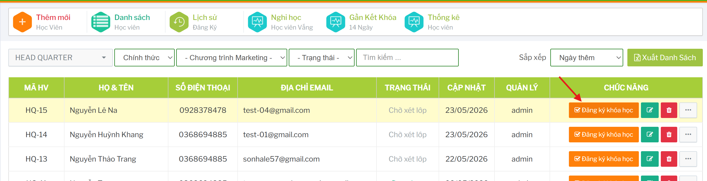
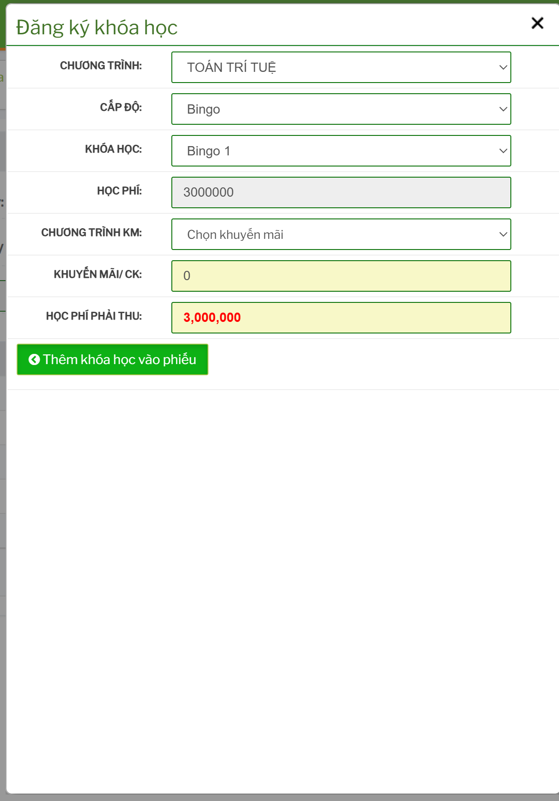
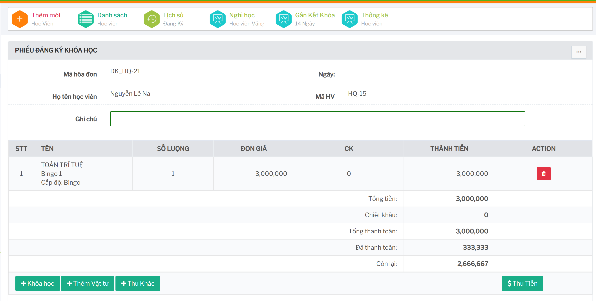
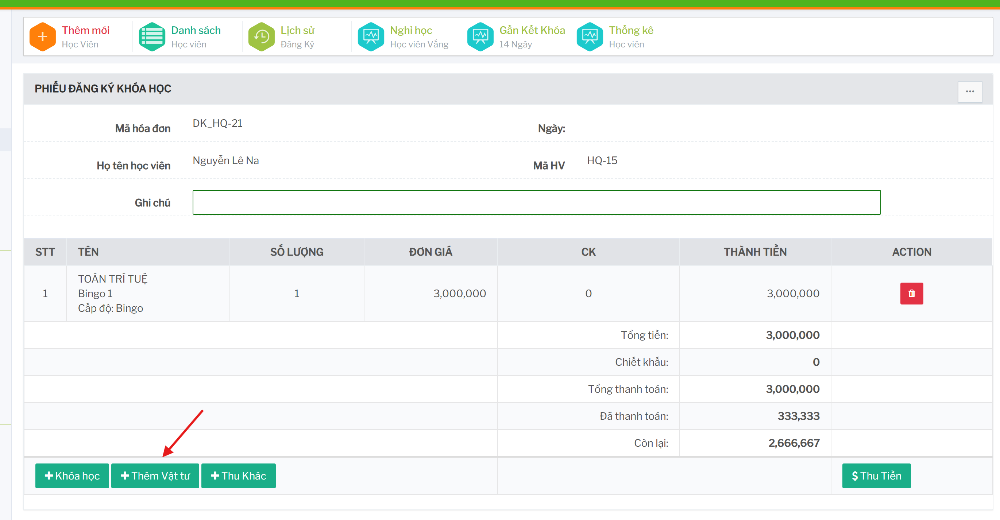
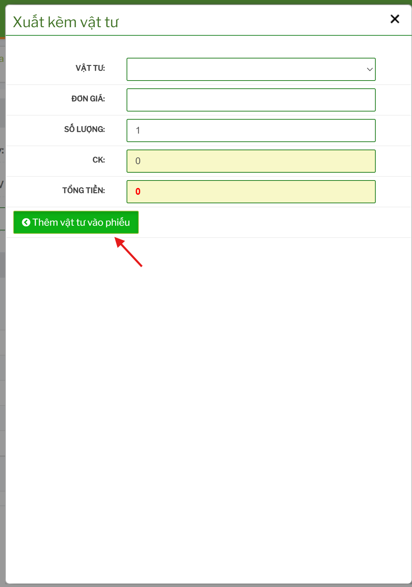
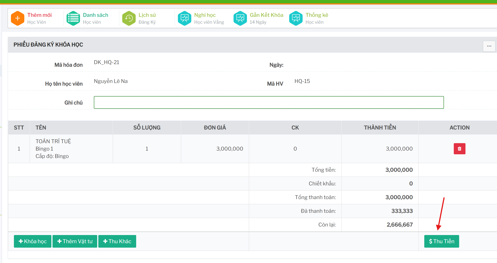
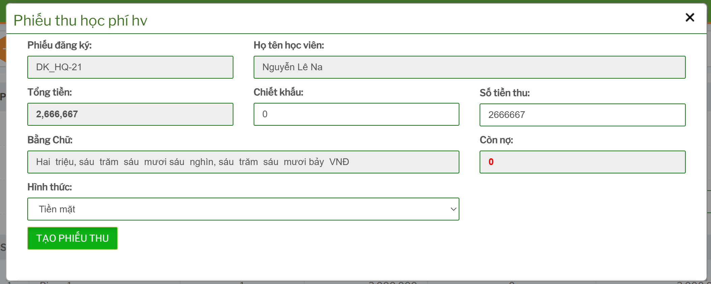

# Đăng ký khóa học cho học viên

## Tính năng dùng để làm gì

Tính năng đăng ký khóa học dùng để tạo phiếu đăng ký cho học viên, thêm khóa học vào phiếu, thêm vật tư/khoản thu khác và thu học phí.

## Mở phiếu đăng ký

Từ danh sách học viên, bấm `Đăng ký khóa học` trên dòng học viên cần thao tác.

 

  

Phiếu hiển thị:

- mã hóa đơn/phiếu
- ngày đăng ký
- họ tên học viên
- mã học viên
- ghi chú
- danh sách khóa học, vật tư hoặc khoản thu trong phiếu
- tổng tiền, đã thu, chiết khấu và còn lại nếu có

## Thêm khóa học vào phiếu

Trong phiếu đăng ký, bấm `Khóa học`.

Các bước thao tác:

1. Chọn chi nhánh.
2. Chọn chương trình.
3. Chọn cấp độ.
4. Chọn khóa học.
5. Kiểm tra học phí.
6. Chọn chương trình khuyến mãi nếu có.
7. Kiểm tra khuyến mãi/chiết khấu.
8. Kiểm tra học phí phải thu.
9. Bấm `Thêm khóa học vào phiếu`.

Nếu học phí phải thu nhỏ hơn `0`, cần kiểm tra lại mức giảm/khuyến mãi trước khi thêm vào phiếu.

## Thêm vật tư

Trong phiếu đăng ký, bấm `Thêm Vật tư`.

Vật tư có thể được lấy theo cấu hình khóa học hoặc thêm thủ công tùy nghiệp vụ. Cần kiểm tra số lượng và đơn giá trước khi lưu.

## Thêm khoản thu khác

Trong phiếu đăng ký, bấm `Thu Khác`.

Chỉ thêm khoản thu khác khi đã thống nhất với kế toán hoặc vận hành, ví dụ phí phát sinh không nằm trong học phí chính.

## Thu học phí

Trong phiếu đăng ký, bấm `Thu Tiền`.

Trước khi thu cần kiểm tra:

- danh sách khóa/vật tư/khoản thu trong phiếu
- tổng tiền phải thu
- số tiền đã thu
- số tiền còn lại
- chiết khấu/khuyến mãi
- phương thức thu và chứng từ nếu có

## In phiếu đăng ký

Menu trên phiếu có các tùy chọn in phiếu đăng ký chi tiết hoặc in phiếu đăng ký tổng.

Chỉ nên in sau khi đã kiểm tra đầy đủ khóa học, học phí, vật tư và khoản thu.

## Xóa phiếu hoặc dòng đăng ký

Chỉ nên xóa phiếu đăng ký khi chưa thu học phí. Nếu đã phát sinh thu tiền, cần xử lý theo quy trình kế toán thay vì xóa trực tiếp.

## Checklist trước khi thu tiền

- Đúng học viên.
- Đúng chi nhánh.
- Đúng chương trình/cấp độ/khóa học.
- Học phí phải thu đúng.
- Khuyến mãi/chiết khấu đúng.
- Vật tư và khoản thu khác đúng.
- Phiếu chưa bị trùng hoặc tạo nhầm.
