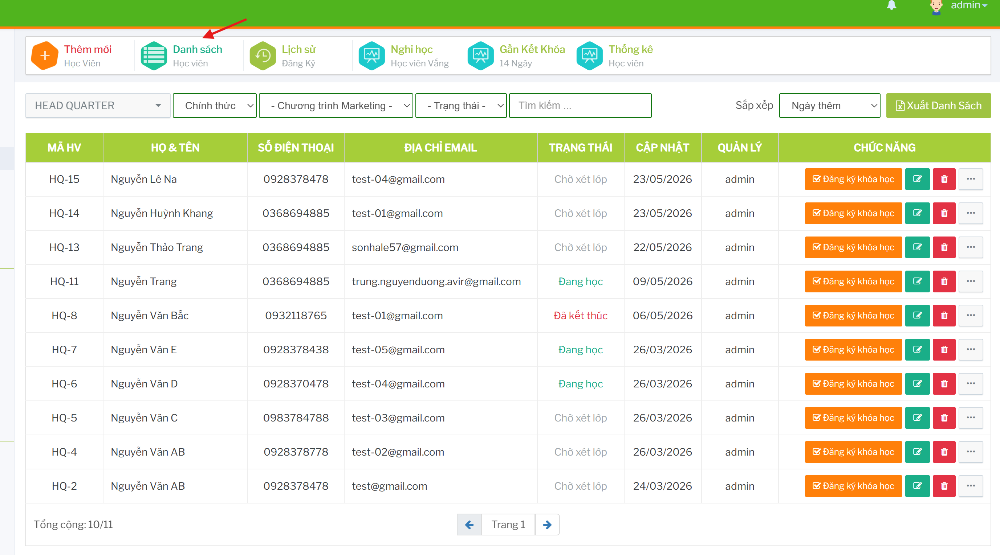
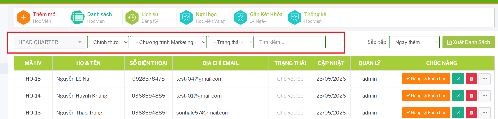
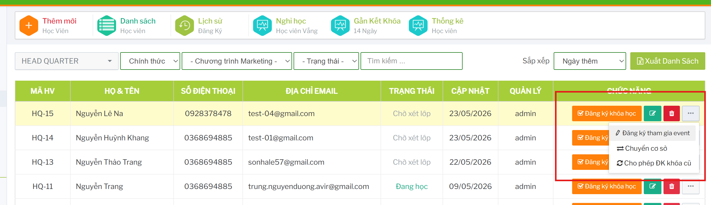
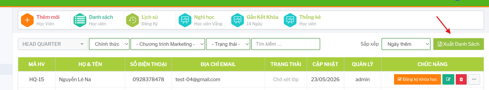

# Danh sách học viên

## Tính năng dùng để làm gì

Màn danh sách học viên dùng để tìm kiếm, lọc và thao tác nhanh trên từng học viên.

Đường dẫn chính:

```text
Học viên -> Danh sách học viên
```

 

## Tìm kiếm và lọc

Trên đầu màn hình có các bộ lọc:
- chi nhánh
- loại học viên: tiềm năng hoặc chính thức
- chương trình marketing nếu có
- trạng thái: bảo lưu, đang học, chờ xét lớp, đã kết thúc, đã hủy
- ô tìm kiếm theo mã, tên, số điện thoại hoặc thông tin đang hỗ trợ
- sắp xếp theo ngày thêm, danh sách A-Z hoặc trạng thái

 

Sau khi đổi bộ lọc, hệ thống tự tải lại danh sách. Có thể bấm `Xuất Danh Sách` để export dữ liệu đang xem.

## Các cột chính

| Cột | Ý nghĩa |
| --- | --- |
| Mã HV | Mã học viên, có thể bấm để xem chi tiết. |
| Họ & tên | Tên học viên. |
| Số điện thoại | Số điện thoại phụ huynh/học viên. |
| Địa chỉ Email | Email liên hệ. |
| Trạng thái | Trạng thái học tập hoặc xử lý hiện tại. |
| Cập nhật | Ngày tạo/cập nhật tùy dữ liệu hiển thị. |
| Quản lý | Người hoặc cơ sở phụ trách. |
| Chức năng | Các nút đăng ký, sửa, xóa và menu thao tác thêm. |

## Thao tác nhanh trên từng học viên

Trên mỗi dòng học viên có thể có:

- `Đăng ký khóa học`
- sửa hồ sơ
- xóa học viên
- menu thao tác thêm
- đăng ký tham gia event
- chuyển cơ sở
- cho phép đăng ký khóa cũ

 

Các thao tác hiển thị tùy quyền tài khoản và trạng thái học viên.

## Đăng ký học viên tham gia sự kiện

Trong menu thao tác thêm, chọn `Đăng ký tham gia event`.


Trên modal, chọn sự kiện/đối tượng áp dụng rồi bấm `Đăng ký`. Nếu danh sách sự kiện trống, cần kiểm tra cấu hình sự kiện, đối tượng áp dụng và điều kiện học viên.

## Export danh sách

Bấm `Xuất Danh Sách` để tải file Excel từ bảng đang hiển thị.

 

Nên kiểm tra bộ lọc trước khi export để tránh xuất nhầm chi nhánh, loại học viên hoặc trạng thái.
