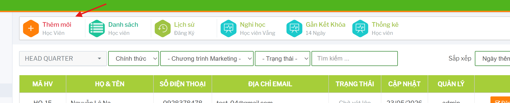
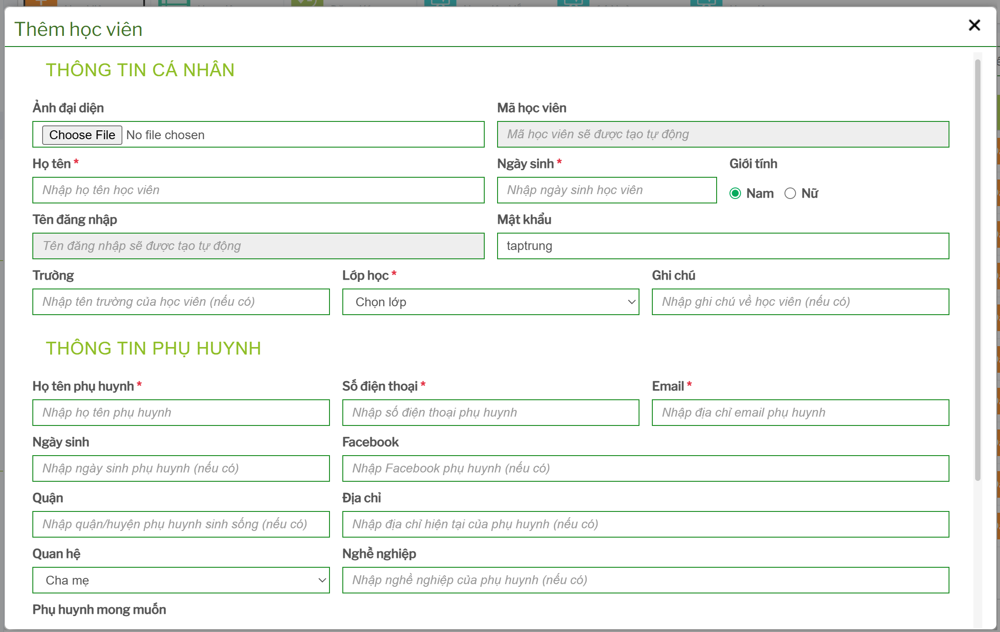
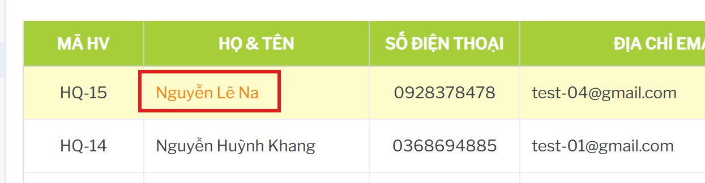
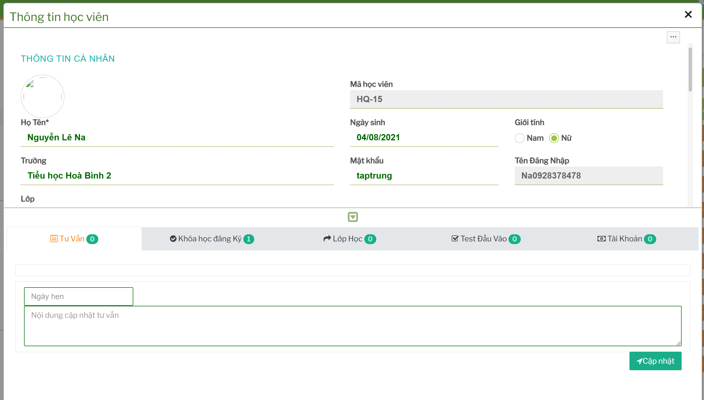
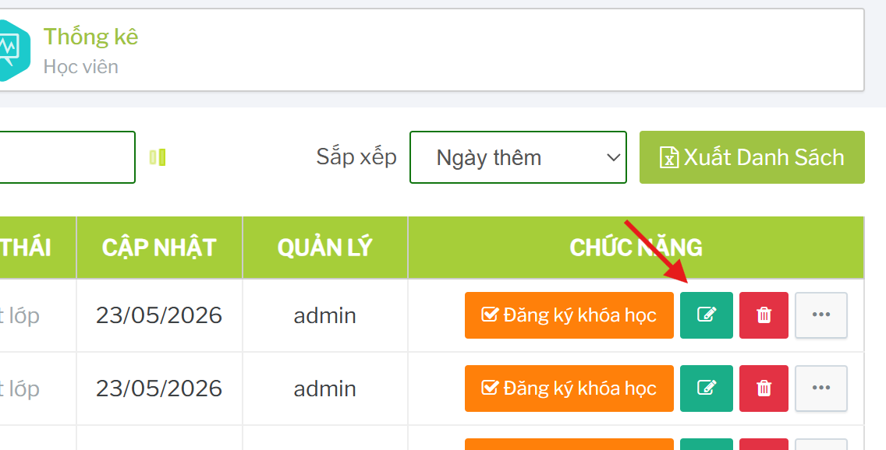
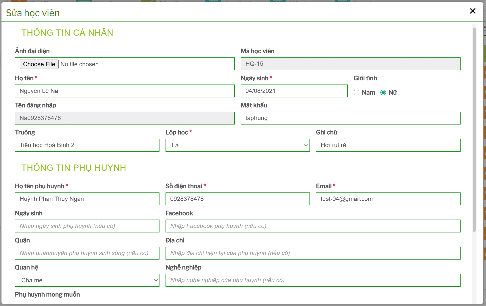

# Hồ sơ học viên

## Tính năng dùng để làm gì

Nhóm hồ sơ học viên dùng để thêm mới, xem chi tiết và chỉnh sửa thông tin học viên.

## Thêm mới học viên

Từ menu trên cùng của module Học viên, bấm `Thêm mới -> Học Viên`.

 

Thông tin trên form được sinh động theo cấu hình hệ thống, nên số lượng trường có thể khác nhau theo môi trường. Các nhóm thông tin thường cần kiểm tra:

- họ tên học viên
- ngày sinh/năm sinh/lớp học
- số điện thoại phụ huynh
- email
- địa chỉ
- chi nhánh/cơ sở
- nguồn hoặc chương trình marketing nếu có
- ghi chú

Sau khi lưu, hệ thống tạo mã học viên để dùng trong danh sách và các phiếu đăng ký.

## Xem chi tiết học viên

Từ màn danh sách, bấm vào mã học viên, tên, số điện thoại hoặc email của học viên.

Màn chi tiết dùng để kiểm tra hồ sơ trước khi đăng ký khóa, xử lý bảo lưu, chuyển lớp hoặc đối chiếu thông tin liên hệ.

## Sửa hồ sơ học viên

Từ dòng học viên, bấm nút sửa có biểu tượng bút.

 
Chỉ nên sửa thông tin sau khi đã xác nhận đúng học viên. Các trường như số điện thoại, email, chi nhánh hoặc thông tin phụ huynh có thể ảnh hưởng đến liên hệ, báo cáo và đăng ký sau này.

## Xóa học viên

Từ dòng học viên, bấm nút xóa nếu có quyền. Hệ thống hỏi xác nhận trước khi xóa.

Chỉ nên xóa khi:

- học viên tạo nhầm
- chưa có đăng ký khóa học
- chưa có học phí/công nợ
- chưa có lịch sử lớp học cần giữ

Nếu học viên đã có lịch sử, nên kiểm tra kỹ hoặc dùng cơ chế trạng thái thay vì xóa.

## Checklist trước khi lưu hồ sơ

- Họ tên đúng chính tả.
- Số điện thoại liên hệ đúng.
- Email đúng nếu dùng để gửi thông báo.
- Chi nhánh/cơ sở đúng.
- Ngày sinh/lớp học đúng.
- Không tạo trùng học viên đã có trong danh sách.
