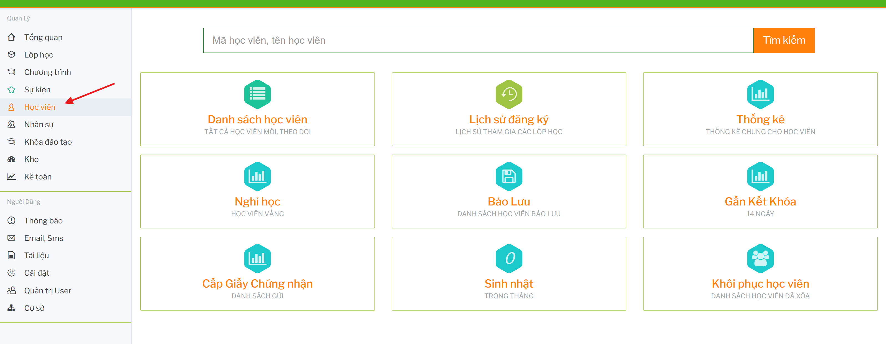

# Sổ tay người dùng: Học viên

## Mục đích

Module Học viên dùng để quản lý toàn bộ dữ liệu học viên và các nghiệp vụ liên quan: hồ sơ, danh sách, đăng ký khóa học, lịch sử đăng ký, bảo lưu, nghỉ học, gần kết khóa, cấp giấy chứng nhận và thống kê.

Đường dẫn sử dụng chính:

```text
Học viên
```

 

## Các khu vực chính

| Khu vực | Mục đích |
| --- | --- |
| Danh sách học viên | Tìm kiếm, lọc, xem hồ sơ, sửa hồ sơ, đăng ký khóa học và thao tác nhanh trên từng học viên. |
| Lịch sử đăng ký | Xem các phiếu đăng ký khóa học, số tiền, đã thanh toán và thao tác liên quan. |
| Thống kê | Xem nhóm học viên đang học, đã kết khóa, tiềm năng hoặc theo bộ lọc. |
| Nghỉ học | Theo dõi học viên vắng/nghỉ học. |
| Bảo lưu | Theo dõi bảo lưu kết quả hoặc bảo lưu học phí. |
| Gần kết khóa | Xem học viên sắp kết thúc khóa trong khoảng 14 ngày. |
| Cấp giấy chứng nhận | Theo dõi danh sách cần cấp/gửi giấy chứng nhận. |
| Khôi phục học viên | Xem và khôi phục học viên đã xóa, thường dành cho Head. |

## Điều kiện chung để sử dụng

Người dùng cần có quyền truy cập module Học viên. Một số thao tác phụ thuộc phân quyền:

- thêm/sửa/xóa học viên
- đăng ký khóa học
- xem lịch sử đăng ký
- thu học phí
- bảo lưu hoặc hủy khóa
- xem thống kê
- cấp giấy chứng nhận
- khôi phục học viên đã xóa

## Ảnh hưởng đến module khác

| Module/tính năng | Ảnh hưởng |
| --- | --- |
| Khóa học | Đăng ký học viên phụ thuộc chương trình, cấp độ, khóa học, học phí và vật tư theo khóa. |
| Lớp học | Học viên sau đăng ký có thể được xét vào lớp, chuyển lớp, gia hạn hoặc kết thúc sớm. |
| Kế toán | Phiếu đăng ký và học phí liên quan đến thu tiền, công nợ và báo cáo. |
| Event | Có thể đăng ký học viên tham gia sự kiện từ danh sách học viên. |
| Kho/vật tư | Đăng ký khóa học có thể phát sinh vật tư/tài liệu đi kèm. |

## Tài liệu con

- [DanhSachHocVien.md](./DanhSachHocVien.md): tìm kiếm, lọc, export và thao tác trên danh sách học viên.
- [HoSoHocVien.md](./HoSoHocVien.md): thêm mới, xem chi tiết và sửa hồ sơ học viên.
- [DangKyKhoaHoc.md](./DangKyKhoaHoc.md): tạo phiếu đăng ký, thêm khóa, vật tư, khoản thu khác và thu học phí.
- [BaoLuuTrangThai.md](./BaoLuuTrangThai.md): bảo lưu, gia hạn, kích hoạt lại, chuyển khóa/lớp và hủy/kết thúc khóa.
- [ThongKeLichSu.md](./ThongKeLichSu.md): lịch sử đăng ký, thống kê học viên và thống kê bảo lưu.
- [LuuYVanHanh.md](./LuuYVanHanh.md): lưu ý vận hành và checklist trước khi sửa dữ liệu học viên.
