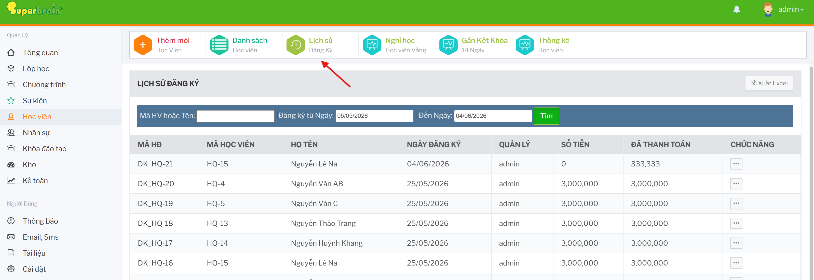
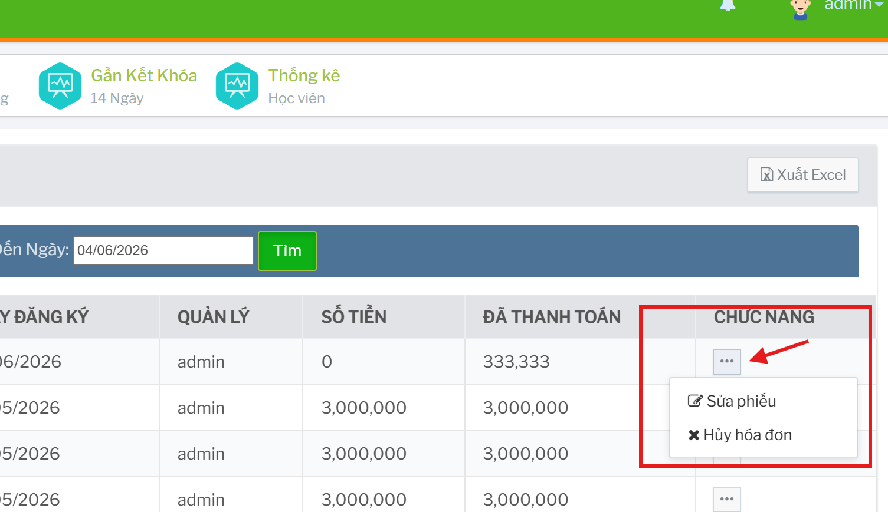
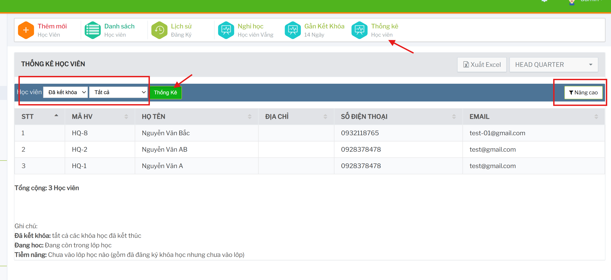

# Thống kê và lịch sử học viên

## Lịch sử đăng ký

Màn lịch sử đăng ký dùng để xem các phiếu đăng ký khóa học theo học viên và khoảng ngày.

Đường dẫn chính:

```text
Học viên -> Lịch sử đăng ký
```



## Tìm kiếm lịch sử đăng ký

Bộ lọc gồm:

- mã học viên hoặc tên
- đăng ký từ ngày
- đến ngày

Bấm `Tìm` để tải danh sách. Có thể bấm `Xuất Excel` để export.

Danh sách hiển thị:

- mã hóa đơn
- mã học viên
- họ tên
- ngày đăng ký
- quản lý
- số tiền
- đã thanh toán
- chức năng

## Thao tác trong lịch sử đăng ký

Tùy quyền và trạng thái phiếu, có thể:

- thu học phí
- chuyển người đăng ký khóa học
- in bảng/phiếu
- xóa phiếu nếu chưa thu học phí

 

## Thống kê học viên

Màn thống kê học viên dùng để xem nhóm học viên theo trạng thái.

Đường dẫn chính:

```text
Học viên -> Thống kê
```


Bộ lọc chính:

- chi nhánh
- loại học viên: đã kết khóa, đang học, tiềm năng
- có lớp chờ/không có lớp chờ nếu áp dụng
- bộ lọc mở rộng

Bấm `Thống Kê` để xem kết quả.



## Ý nghĩa nhóm thống kê

| Nhóm | Ý nghĩa |
| --- | --- |
| Đã kết khóa | Các khóa học đã kết thúc. |
| Đang học | Học viên đang còn trong lớp học. |
| Tiềm năng | Học viên chưa vào lớp học nào, gồm cả đã đăng ký nhưng chưa vào lớp. |

## Các danh sách đặc thù

Từ dashboard học viên có thể mở thêm:

- Nghỉ học
- Bảo lưu
- Gần kết khóa
- Cấp giấy chứng nhận
- Sinh nhật trong tháng
- Khôi phục học viên đã xóa

Các danh sách này phục vụ theo dõi vận hành, nhắc lịch và xử lý trạng thái học viên. 

## Checklist khi đối chiếu báo cáo

- Chọn đúng chi nhánh.
- Chọn đúng khoảng ngày nếu màn có bộ lọc ngày.
- Hiểu rõ nhóm đang xem: đang học, tiềm năng, đã kết khóa hay bảo lưu.
- Khi số liệu lệch, kiểm tra cả phiếu đăng ký, học phí, lớp học và trạng thái bảo lưu.
