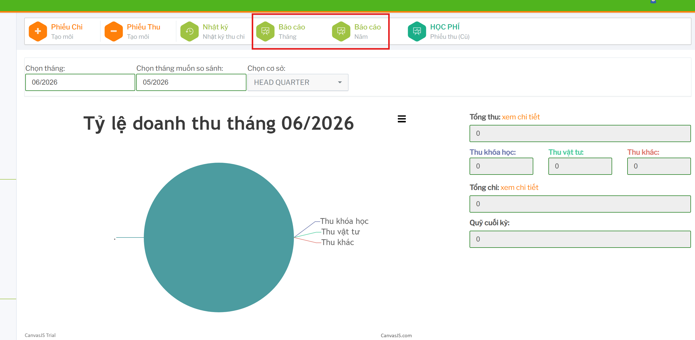
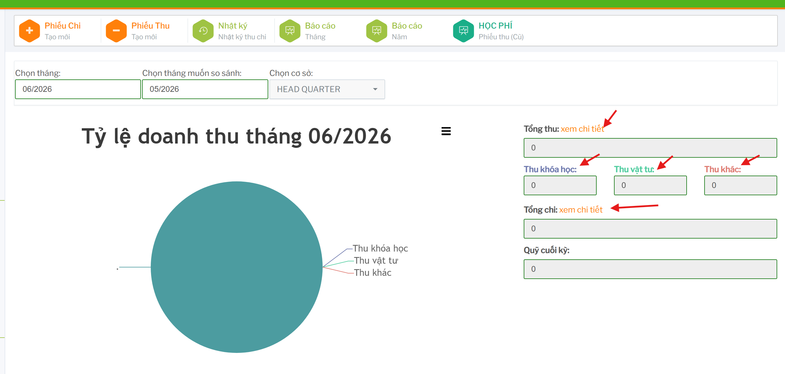
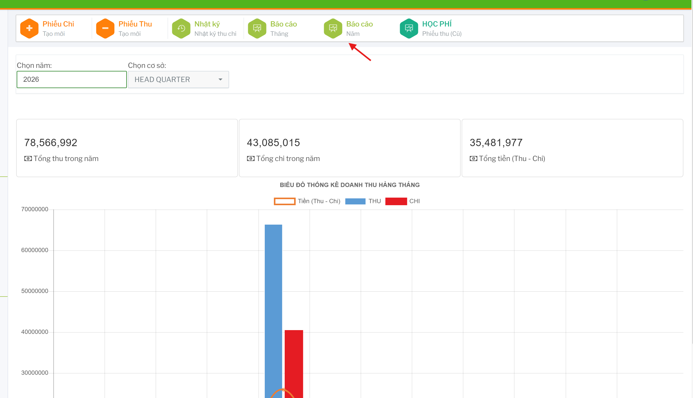

# Báo cáo thống kê kế toán

Nhóm báo cáo kế toán dùng để xem tổng thu, tổng chi, quỹ cuối kỳ, lợi nhuận và cơ cấu doanh thu theo thời gian.

## Báo cáo tháng

Vào `BÁO CÁO THÁNG` để xem báo cáo theo tháng.

Chọn `Tháng`, `Tháng muốn so sánh` và `Cơ sở`.

Màn hình hiển thị:

- `Tổng thu`
- `Thu khóa học`
- `Thu vật tư`
- `Thu khác`
- `Tổng chi`
- `Quỹ cuối kỳ`
- Biểu đồ tỷ lệ doanh thu tháng.
- Biểu đồ doanh thu khóa học theo chương trình.

### Xem chi tiết tổng thu hoặc tổng chi

Tại dòng `Tổng thu` hoặc `Tổng chi`, bấm `xem chi tiết`.

 

Hệ thống mở popup chi tiết doanh thu theo loại đang chọn.

### Xem chi tiết thu theo nhóm

Bấm vào link nhóm thu như `Thu khóa học`, `Thu vật tư` hoặc `Thu khác`.

Hệ thống mở popup chi tiết phiếu thu theo nhóm.

## Báo cáo năm

Vào `BÁO CÁO NĂM` để xem tổng hợp theo năm.

Chọn `Năm` và `Cơ sở`.

Màn hình hiển thị tổng thu trong năm, tổng chi trong năm, tổng tiền thu trừ chi và biểu đồ theo từng tháng.
