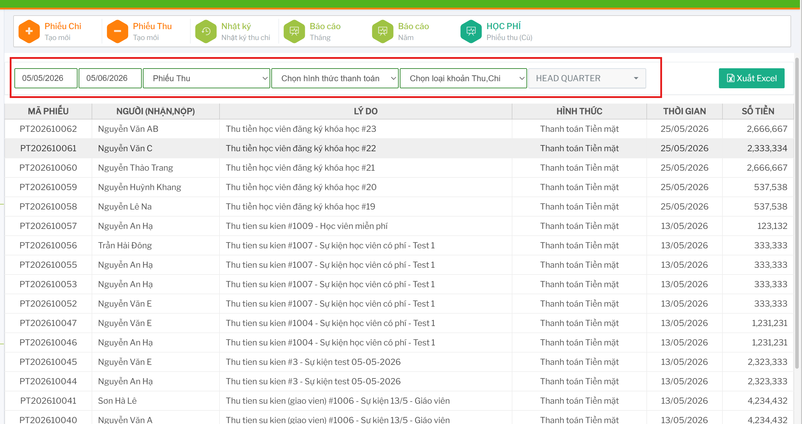

# Nhật ký thu chi

Màn `NHẬT KÝ` dùng để tra cứu các phiếu thu/chi đã phát sinh trong hệ thống.

## Lọc dữ liệu

Tại khu vực bộ lọc, chọn khoảng ngày và các điều kiện cần xem.

Các bộ lọc gồm: 

- `Từ ngày`, `Đến ngày`: khoảng thời gian phát sinh phiếu.
- `Phiếu Thu` hoặc `Phiếu Chi`: loại phiếu cần xem.
- `Hình thức thanh toán`: tiền mặt, quẹt thẻ, chuyển khoản hoặc khác.
- `Loại khoản Thu, Chi`: đăng ký khóa học, khóa đào tạo, phí thương hiệu, vật tư hoặc khác.
- `Chi nhánh`: cơ sở cần xem nếu tài khoản có quyền chọn.

Khi thay đổi bộ lọc, hệ thống tải lại danh sách phiếu tương ứng.

## Đọc bảng nhật ký

Bảng nhật ký hiển thị:

- `Mã phiếu`
- `Người (nhận, nộp)`
- `Lý do`
- `Hình thức`
- `Thời gian`
- `Số tiền`

## Xuất Excel

Sau khi lọc đúng dữ liệu, bấm `Xuất Excel`.

File xuất ra theo dữ liệu đang hiển thị trên bảng.

## Xóa hoặc hủy phiếu trong nhật ký

Nếu tài khoản được hiển thị nút xóa trên dòng phiếu, bấm nút xóa tại dòng cần xử lý.

Hệ thống hiển thị hộp thoại xác nhận. Chỉ xác nhận khi đã chắc chắn phiếu cần xử lý đúng.

Sau khi xử lý, tải lại nhật ký để kiểm tra số liệu.
