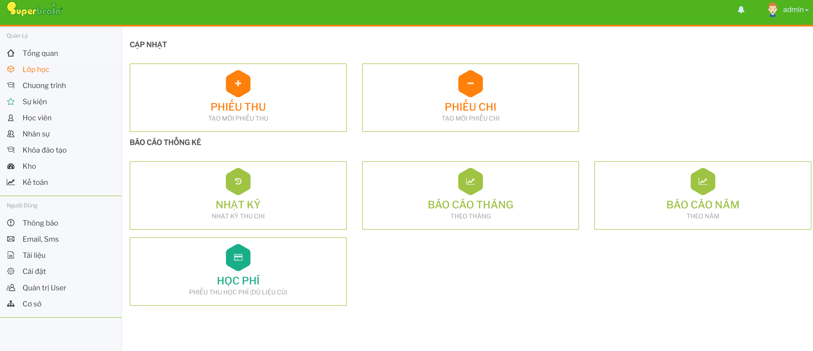

# Tổng quan module Kế toán

Module `Kế toán` dùng để tạo phiếu thu/phiếu chi thủ công, theo dõi nhật ký thu chi và xem các báo cáo tài chính đang được dùng trong luồng vận hành hiện tại.

## Chức năng đang có trên UI

- `PHIẾU THU`: tạo phiếu thu thủ công cho các khoản thu khác.
- `PHIẾU CHI`: tạo phiếu chi thủ công cho các khoản chi khác.
- `NHẬT KÝ`: tra cứu danh sách phiếu thu/chi đã phát sinh.
- `BÁO CÁO THÁNG`: xem tổng thu, tổng chi, quỹ cuối kỳ và doanh thu theo nhóm.
- `BÁO CÁO NĂM`: xem tổng thu, tổng chi và biểu đồ theo 12 tháng.

## Luồng sử dụng đề xuất

1. Tạo phiếu thu hoặc phiếu chi thủ công khi khoản tiền không phát sinh từ các module nghiệp vụ khác.
2. Dùng `NHẬT KÝ` để kiểm tra lại phiếu đã tạo và xuất Excel khi cần đối soát.
3. Dùng `BÁO CÁO THÁNG` và `BÁO CÁO NĂM` để theo dõi tình hình tài chính theo các lối vào đang dùng trong vận hành.

## Liên kết tài liệu

- [Phiếu thu, phiếu chi](PhieuThuChi.md)
- [Nhật ký thu chi](NhatKyThuChi.md)
- [Báo cáo thống kê](BaoCaoThongKe.md)
- [Lưu ý vận hành](LuuYVanHanh.md)
