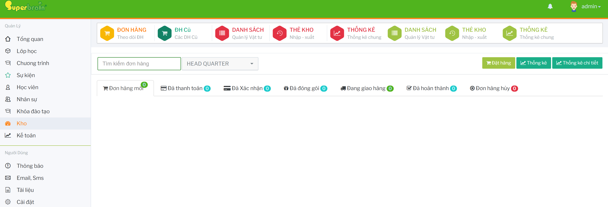

# Đơn hàng kho

Màn `ĐƠN HÀNG` dùng để tạo, theo dõi và cập nhật trạng thái đơn hàng vật tư.

Từ dashboard `Kho`, bấm thẻ `ĐƠN HÀNG`.

Hệ thống mở màn theo dõi đơn hàng. 

## Tìm kiếm và lọc đơn hàng

Nhập từ khóa vào ô `Tìm kiếm đơn hàng`. Nếu tài khoản có quyền chọn chi nhánh, chọn chi nhánh cần xem.

## Theo dõi trạng thái đơn hàng

Danh sách đơn hàng được chia theo các tab:

- `Đơn hàng mới`
- `Đã thanh toán`
- `Đã Xác nhận`
- `Đã đóng gói`
- `Đang giao hàng`
- `Đã hoàn thành`
- `Đơn hàng hủy`

Chọn tab tương ứng để xem các đơn đang ở trạng thái đó.

## Tạo đơn hàng mới

Tại màn đơn hàng, bấm `Đặt hàng`.

Hệ thống mở form `Thêm đơn hàng mới`. Chọn vật tư, nhập số lượng và thông tin giao nhận cần thiết, sau đó lưu đơn hàng.

## Cập nhật trạng thái đơn hàng

Ở các trạng thái cần xử lý, bấm vào mã đơn hàng hoặc nút cập nhật trạng thái trên thẻ đơn.

Hệ thống mở form `Cập nhật đơn hàng`. Cập nhật trạng thái, chứng từ hoặc ghi chú theo yêu cầu của bước xử lý.

## Theo dõi chi tiết đơn hàng

Với đơn đã qua các bước xử lý, bấm mã đơn hàng để mở màn theo dõi.

Modal `Theo dõi đơn hàng` hiển thị các mốc như đã thanh toán, đã xác nhận, đã đóng gói, đang vận chuyển hoặc đã nhận hàng.

## In và xuất thông tin đơn hàng

Trên thẻ đơn hàng, bấm `Xuất Excel` hoặc nút in chi tiết nếu cần xuất dữ liệu đơn hàng.

Hệ thống mở màn in/xuất chi tiết đơn hàng.

Nếu cần in phiếu xuất kho, bấm nút in phiếu xuất kho trên đơn hàng.

## Hủy đơn hàng

Trên đơn hàng cần hủy, bấm `Hủy`.

Nhập lý do hủy và xác nhận.

Sau khi hủy, kiểm tra lại đơn trong tab `Đơn hàng hủy`.
