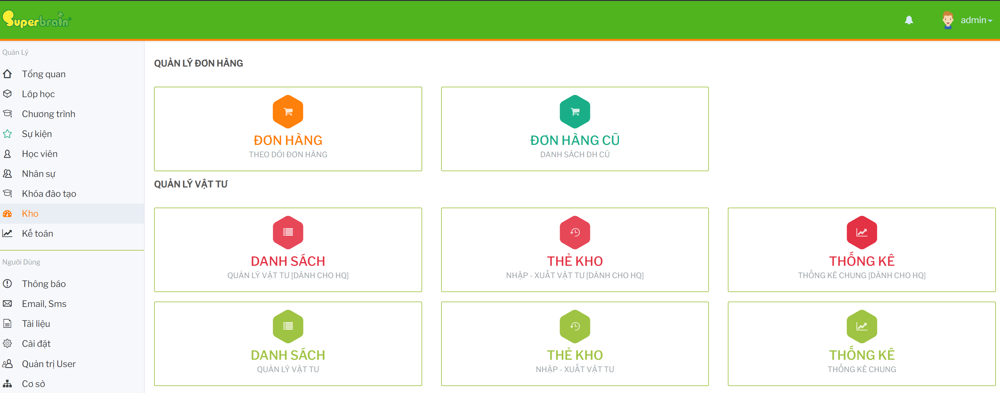

# Tổng quan module Kho

Module `Kho` dùng để theo dõi đơn hàng vật tư, quản lý danh sách vật tư/tồn kho, xem thẻ kho và thống kê nhập xuất kho.

## Chức năng chính 

- `ĐƠN HÀNG`: theo dõi và cập nhật đơn hàng vật tư theo trạng thái.
- `DANH SÁCH`: quản lý danh sách vật tư và tồn kho.
- `THẺ KHO`: tra cứu lịch sử nhập kho, xuất kho theo khoảng ngày.
- `THỐNG KÊ`: xem tổng hợp tồn đầu kỳ, nhập, xuất và tồn cuối kỳ.

## Luồng sử dụng đề xuất

1. Vào `ĐƠN HÀNG` để tạo hoặc theo dõi đơn hàng vật tư.
2. Dùng các tab trạng thái để kiểm soát tiến trình xử lý đơn hàng.
3. Vào `DANH SÁCH` để kiểm tra tồn kho, nhập vật tư, xuất vật tư hoặc cập nhật thông tin vật tư.
4. Dùng `THẺ KHO` để đối chiếu chi tiết từng giao dịch nhập/xuất.
5. Dùng `THỐNG KÊ` để xem tổng hợp theo khoảng ngày và xuất Excel khi cần báo cáo.

## Liên kết tài liệu

- [Đơn hàng kho](DonHang.md)
- [Vật tư và tồn kho](VatTuTonKho.md)
- [Thẻ kho và thống kê](TheKhoThongKe.md)
- [Lưu ý vận hành](LuuYVanHanh.md)
