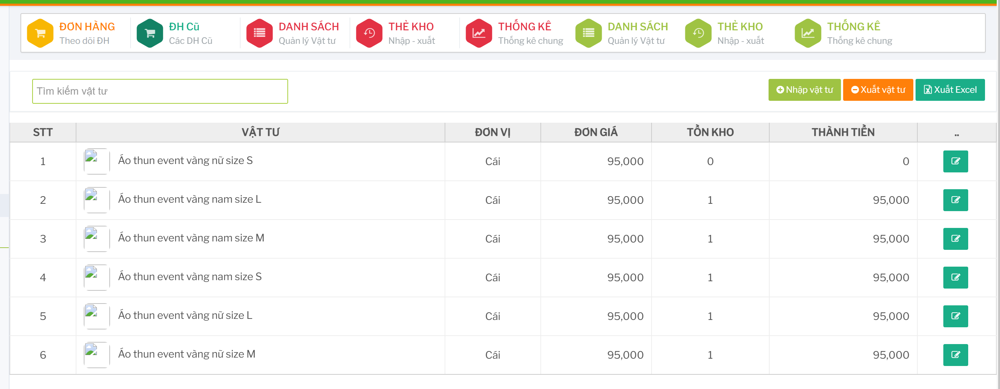

# Vật tư và tồn kho

Màn `DANH SÁCH` dùng để xem danh sách vật tư, tồn kho và thực hiện các thao tác nhập/xuất hoặc cập nhật vật tư.

## Danh sách vật tư cơ sở

Vào `DANH SÁCH` trong nhóm quản lý vật tư để xem tồn kho của cơ sở.

 

Người dùng có thể tìm vật tư bằng ô tìm kiếm.

Bảng danh sách hiển thị vật tư, đơn vị, đơn giá, tồn kho và thành tiền.

## Danh sách vật tư dành cho HQ

Tài khoản HQ có thể mở danh sách vật tư toàn hệ thống.

Màn này có thêm thông tin hệ số, định mức, tổng 6 tháng, trung bình 6 tháng và cài đặt bán.

## Thêm danh mục vật tư

Trên danh sách HQ, bấm `Thêm danh mục`.

Nhập tên, mô tả, thứ tự hiển thị và trạng thái rồi lưu.

## Tạo mã vật tư mới

Trên danh sách HQ, bấm `Tạo mã mới`.

Nhập thông tin vật tư mới rồi lưu.

## Nhập vật tư

Bấm `Nhập vật tư`.

Hệ thống mở form tạo phiếu nhập kho. Chọn vật tư, nhập số lượng, đơn giá và ghi chú cần thiết rồi lưu.

## Xuất vật tư

Bấm `Xuất vật tư`.

Hệ thống mở form tạo phiếu xuất kho. Chọn vật tư, nhập số lượng, lý do xuất và kiểm tra tồn kho trước khi lưu.

## Sửa vật tư

Trên dòng vật tư cần cập nhật, bấm nút sửa.

Cập nhật thông tin vật tư rồi lưu lại.

## Cài đặt Sale

Trên dòng vật tư cần cấu hình bán, bấm `Cài đặt Sale`.

Nhập thông tin cài đặt bán rồi lưu.

## Xóa hoặc ngừng áp dụng vật tư

Trên dòng vật tư cần xử lý, bấm nút xóa.

Hệ thống hiển thị hộp thoại xác nhận. Chỉ xác nhận khi đã chắc chắn vật tư không còn được cơ sở đặt hàng hoặc sử dụng.

## Xuất Excel

Bấm `Xuất Excel` để xuất danh sách vật tư đang hiển thị. Trước khi xuất nên lọc đúng nhóm dữ liệu cần báo cáo.
