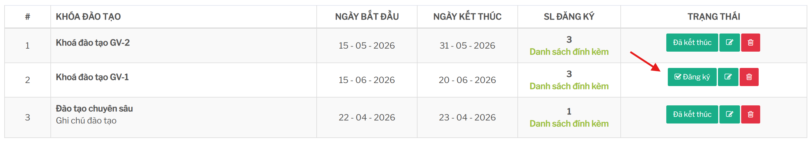
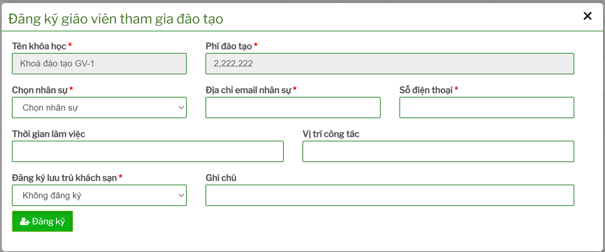
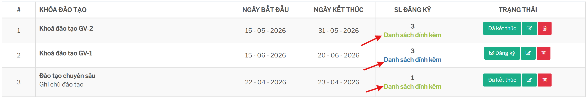
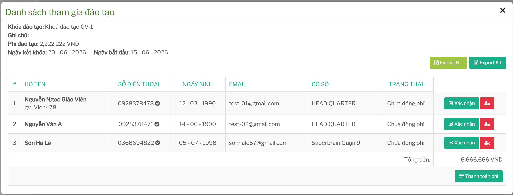

# Đăng ký giáo viên tham gia đào tạo

## Tính năng dùng để làm gì

Tính năng đăng ký dùng để chọn giáo viên/nhân sự tham gia một khóa đào tạo cụ thể. Sau khi đăng ký, giáo viên xuất hiện trong danh sách tham gia của khóa và được dùng cho các bước thanh toán, đánh giá, in chứng nhận hoặc gửi kết quả.

## Điều kiện trước khi đăng ký

Trước khi đăng ký cần kiểm tra:

- khóa đào tạo đã được tạo
- khóa còn trong thời gian/hạn đăng ký theo quy định vận hành
- giáo viên/nhân sự đã có hồ sơ trong hệ thống
- email và số điện thoại còn đúng
- thông tin cơ sở, vị trí công tác và thời gian làm việc không bị sai
- khóa có phí hay miễn phí để chuẩn bị bước thanh toán

## Quy trình đăng ký

Từ màn danh sách khóa đào tạo, tìm dòng của khóa cần thao tác rồi nhìn sang cột `TRẠNG THÁI`.

Nếu khóa đang cho phép đăng ký, cột này sẽ có nút màu xanh `Đăng ký`. Bấm nút đó để mở form `Đăng ký giáo viên tham gia đào tạo`. 

Nếu không thấy nút `Đăng ký`, cần kiểm tra trạng thái của khóa:

- `Sắp diễn ra`: khóa chưa mở đăng ký, đã hết hạn đăng ký hoặc đã đủ số lượng.
- `Đang diễn ra`: khóa đang trong thời gian đào tạo, không còn là bước đăng ký thông thường.
- `Đã kết thúc`: khóa đã qua ngày kết thúc; tài khoản Head có thể thấy thao tác kết thúc/đánh giá thay vì đăng ký.

 

Các thông tin cần kiểm tra/nhập:

| Thông tin | Ý nghĩa |
| --- | --- |
| Tên khóa học | Khóa đào tạo đang đăng ký. |
| Phí đào tạo | Số phí áp dụng cho khóa. |
| Chọn nhân sự | Giáo viên/nhân sự tham gia khóa. |
| Địa chỉ email nhân sự | Dùng để liên hệ hoặc gửi kết quả. |
| Số điện thoại | Dùng để đối chiếu danh sách và liên hệ. |
| Thời gian làm việc | Thông tin tham khảo từ hồ sơ nhân sự. |
| Vị trí công tác | Chức danh/vị trí của người tham gia. |
| Đăng ký lưu trú khách sạn | Chọn có/không đăng ký lưu trú. |
| Ghi chú | Ghi chú thêm cho lượt đăng ký. |

Khi chọn nhân sự, hệ thống sẽ tải lại một số thông tin hồ sơ như email, số điện thoại, thời gian làm việc và vị trí công tác. Người dùng cần kiểm tra lại trước khi bấm `Đăng ký`.

## Xem danh sách tham gia

Từ danh sách khóa, mở chức năng xem danh sách tham gia để kiểm tra người đã đăng ký.
 

 

Bảng danh sách gồm các thông tin chính:

- họ tên
- số điện thoại
- ngày sinh
- email
- cơ sở
- trạng thái

Màn này có các nút export phục vụ hai mục đích:

- `Export ĐT`: xuất danh sách phục vụ đào tạo
- `Export KT`: xuất danh sách phục vụ kế toán/đối chiếu

## Hủy hoặc xóa lượt đăng ký

Một số thao tác trên danh sách có thể cho phép xóa người tham gia khỏi khóa. Chỉ nên xóa khi đăng ký nhầm hoặc chưa phát sinh thanh toán/đánh giá.

Không nên xóa lượt đăng ký nếu:

- người đó đã được tính phí
- đã có chứng từ thanh toán liên quan
- đã được đánh giá kết quả
- đã in chứng nhận hoặc gửi kết quả

Trong các trường hợp đã phát sinh nghiệp vụ, nên trao đổi với vận hành/kế toán trước khi xử lý.

## Lỗi thường gặp

| Tình huống | Cách xử lý |
| --- | --- |
| Không thấy nhân sự trong danh sách chọn | Kiểm tra hồ sơ nhân sự, quyền truy cập và cơ sở của tài khoản. |
| Báo nhân sự đã được đăng ký | Kiểm tra danh sách tham gia, tránh đăng ký trùng cùng một khóa. |
| Email/số điện thoại sai | Cập nhật lại hồ sơ nhân sự hoặc chỉnh thông tin trước khi lưu đăng ký nếu màn cho phép. |
| Danh sách export thiếu người | Tải lại danh sách, kiểm tra trạng thái đăng ký và bộ lọc quyền theo cơ sở. |

## Checklist trước khi đăng ký

- Đã chọn đúng khóa đào tạo.
- Đã chọn đúng giáo viên/nhân sự.
- Email và số điện thoại đúng.
- Cơ sở/vị trí công tác phù hợp.
- Đã xác nhận nhu cầu lưu trú khách sạn nếu có.
- Ghi chú rõ ràng nếu có thông tin đặc biệt.
