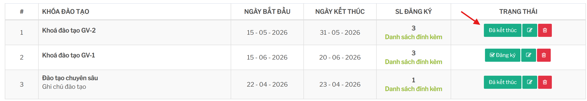
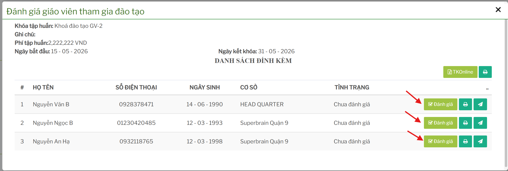
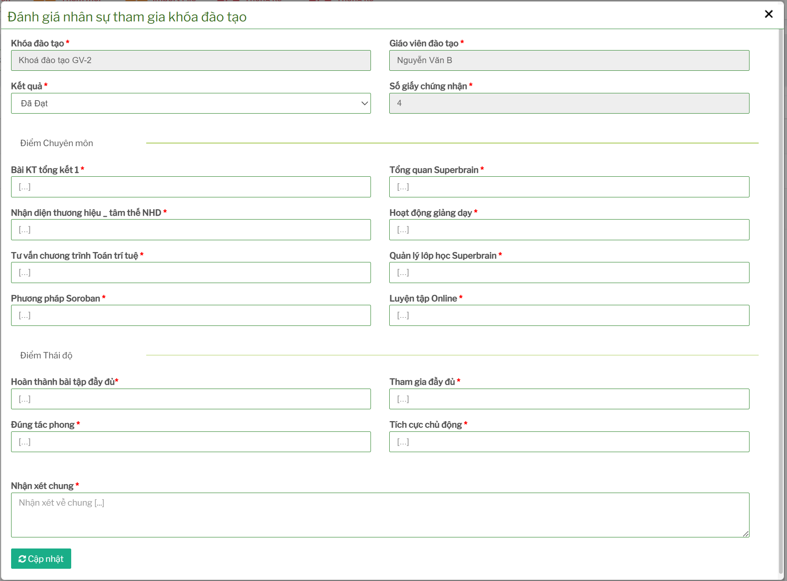

# Đánh giá và kết thúc khóa đào tạo

## Tính năng dùng để làm gì

Tính năng đánh giá/kết thúc dùng để nhập kết quả đào tạo cho từng giáo viên, cập nhật điểm chuyên môn, điểm thái độ, nhận xét chung, in chứng nhận và gửi kết quả.

## Điều kiện trước khi đánh giá

Trước khi đánh giá cần kiểm tra:

- khóa đào tạo đã có danh sách giáo viên tham gia
- giáo viên thực tế đã tham gia hoặc có trạng thái xử lý rõ ràng
- phí đào tạo đã được đối chiếu nếu khóa có phí
- người đánh giá có đủ thông tin điểm và nhận xét
- mẫu chứng nhận/số chứng nhận đã sẵn sàng nếu người học đạt

## Nhập kết quả đánh giá

Từ danh sách khóa hoặc danh sách người tham gia, mở chức năng đánh giá cho giáo viên cần cập nhật.
 

 

Các trạng thái kết quả:

| Kết quả | Ý nghĩa |
| --- | --- |
| Đã Đạt | Giáo viên hoàn thành yêu cầu khóa đào tạo. |
| Chưa Đạt | Giáo viên chưa đạt yêu cầu. |
| Bảo lưu | Giáo viên được bảo lưu kết quả/lượt học theo nghiệp vụ. |
| Không tham gia | Giáo viên đăng ký nhưng không tham gia thực tế. |

## Nhóm điểm chuyên môn

Màn đánh giá có các ô điểm chuyên môn:

- Bài KT tổng kết 1
- Tổng quan Superbrain
- Nhận diện thương hiệu/tâm thế NHD
- Hoạt động giảng dạy
- Tư vấn chương trình Toán trí tuệ
- Quản lý lớp học Superbrain
- Phương pháp Soroban
- Luyện tập Online

Người nhập cần dùng cùng một thang điểm/quy chuẩn đã thống nhất nội bộ để tránh lệch kết quả giữa các khóa.

## Nhóm điểm thái độ

Màn đánh giá có các ô điểm thái độ:

- Hoàn thành bài tập đầy đủ
- Tham gia đầy đủ
- Đúng tác phong
- Tích cực chủ động

Nhóm điểm này nên được nhập sau khi đối chiếu điểm danh, bài tập và nhận xét của người phụ trách đào tạo.

## Nhận xét chung

Ô nhận xét chung dùng để ghi nhận kết luận đào tạo hoặc lưu ý sau khóa. Nên ghi rõ nhưng ngắn gọn:

- điểm mạnh
- điểm cần cải thiện
- yêu cầu học lại/bảo lưu nếu có
- lưu ý trước khi cấp chứng nhận hoặc gửi kết quả

## Xem kết quả, in chứng nhận và gửi kết quả

Sau khi đánh giá, người dùng có thể:

- xem kết quả đào tạo của từng giáo viên
- in giấy chứng nhận
- in chứng nhận theo cơ sở nếu tài khoản có quyền
- gửi email kết quả cho một giáo viên
- gửi email kết quả cho danh sách
- export file phục vụ import tài khoản online

Chỉ nên in chứng nhận hoặc gửi kết quả sau khi đã kiểm tra điểm, trạng thái và số giấy chứng nhận.

## Import đánh giá

(Chức năng có mặt trong code nhưng chưa triển khai ra giao diện)

Màn kết thúc có chức năng import đánh giá kết quả khóa đào tạo. Chức năng này nên dùng khi cần cập nhật nhiều giáo viên cùng lúc từ file.

Trước khi import cần kiểm tra:

- file đúng mẫu
- mã giáo viên/nhân sự đúng
- mã khóa đào tạo đúng
- cột điểm và trạng thái đúng quy định
- không import đè nhầm dữ liệu đã chốt

## Checklist trước khi chốt kết quả

- Đã đánh giá đủ giáo viên trong danh sách.
- Kết quả Đạt/Chưa đạt/Bảo lưu/Không tham gia đúng thực tế.
- Điểm chuyên môn và thái độ dùng cùng một quy chuẩn.
- Nhận xét chung không nhầm giáo viên.
- Số chứng nhận đúng với người đạt.
- Chỉ gửi email/in chứng nhận sau khi đã rà soát lần cuối.
