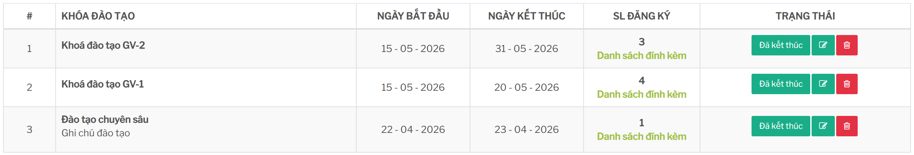

# Sổ tay người dùng: Khóa đào tạo

## Mục đích

Module Khóa đào tạo dùng để quản lý các khóa đào tạo/tập huấn dành cho giáo viên hoặc nhân sự. Người dùng có thể:

- tạo khóa đào tạo mới
- theo dõi danh sách khóa đào tạo
- đăng ký giáo viên/nhân sự tham gia khóa
- xem và export danh sách đăng ký
- ghi nhận thanh toán phí đào tạo
- đánh giá kết quả sau đào tạo
- in chứng nhận hoặc gửi kết quả cho giáo viên
- xem thống kê đào tạo và thống kê kế toán

Đường dẫn sử dụng chính:

```text
Khóa đào tạo -> Danh sách
```



Một số màn trong hệ thống dùng tên kỹ thuật `Khoadaotao` hoặc `khoataphuan`; trong tài liệu này gọi chung là Khóa đào tạo.

## Khi nào dùng module này

Dùng module Khóa đào tạo khi Head Office hoặc trung tâm cần tổ chức một khóa tập huấn có danh sách người tham gia riêng, có phí đào tạo, có kết quả đánh giá và có thể cần cấp chứng nhận.

Ví dụ:

- khóa đào tạo Finger
- khóa đào tạo Soroban
- khóa tập huấn giáo viên mới
- khóa đánh giá lại hoặc bổ sung chứng nhận cho giáo viên
- danh sách giáo viên xuất sắc cần import vào hệ thống

## Các khu vực chính

| Khu vực | Mục đích |
| --- | --- |
| Danh sách | Xem toàn bộ khóa đào tạo, số lượng đăng ký và trạng thái. |
| Thêm mới | Tạo khóa đào tạo với tên, phí, số lượng, thời gian và nội dung thông báo. |
| Đăng ký | Chọn giáo viên/nhân sự tham gia khóa, cập nhật email, điện thoại, lưu trú và ghi chú. |
| Thanh toán phí | Upload chứng từ, tính số tiền cần thanh toán và gửi thông tin thanh toán đến Head. |
| Đánh giá/kết thúc | Nhập điểm, kết quả, nhận xét, in chứng nhận và gửi kết quả. |
| Thống kê | Xem báo cáo đào tạo hoặc báo cáo kế toán theo quyền được cấp. |

## Điều kiện chung để sử dụng

Người dùng cần có quyền truy cập module Khóa đào tạo. Một số thao tác chỉ hiển thị với tài khoản Head hoặc tài khoản có phân quyền riêng, ví dụ:

- thêm khóa đào tạo
- import giáo viên xuất sắc
- xem thống kê đào tạo
- xem thống kê kế toán
- export dữ liệu
- xác nhận thanh toán hoặc tạo tài khoản

Trước khi tạo khóa đào tạo cần chuẩn bị:

- tên khóa đào tạo
- loại khóa đào tạo: Finger hoặc Soroban
- số lượng dự kiến
- phí đào tạo
- hạn đăng ký
- ngày bắt đầu và ngày kết thúc
- ghi chú/nội dung thông báo
- quy định thanh toán nếu khóa có phí

## Ảnh hưởng đến module khác

| Module/tính năng | Ảnh hưởng |
| --- | --- |
| Nhân sự/Giáo viên | Dùng hồ sơ nhân sự để đăng ký, lấy email, số điện thoại, vị trí công tác và cơ sở. |
| Kế toán/Thu chi | Dùng khi ghi nhận phí đào tạo, chứng từ thanh toán và trạng thái đã/chưa thanh toán. |
| Sự kiện | Một số sự kiện dành cho giáo viên có thể lọc theo khóa tập huấn/đào tạo đã tham gia. |
| Tài khoản online | Sau khi hoàn tất hoặc đạt kết quả, hệ thống có thể export/import dữ liệu tạo tài khoản online. |
| Email | Có thể gửi kết quả đào tạo cho giáo viên sau khi đánh giá. |

## Tài liệu con

- [QuanLyKhoaDaoTao.md](./QuanLyKhoaDaoTao.md): tạo, sửa, xóa và theo dõi danh sách khóa đào tạo.
- [DangKyGiaoVien.md](./DangKyGiaoVien.md): đăng ký giáo viên/nhân sự, xem và export danh sách tham gia.
- [ThanhToanPhi.md](./ThanhToanPhi.md): cập nhật chứng từ, tính phí và gửi thanh toán.
- [DanhGiaKetThuc.md](./DanhGiaKetThuc.md): nhập kết quả, điểm đánh giá, in chứng nhận và gửi kết quả.
- [LuuYVanHanh.md](./LuuYVanHanh.md): lưu ý vận hành, lỗi thường gặp và checklist trước khi thao tác.
