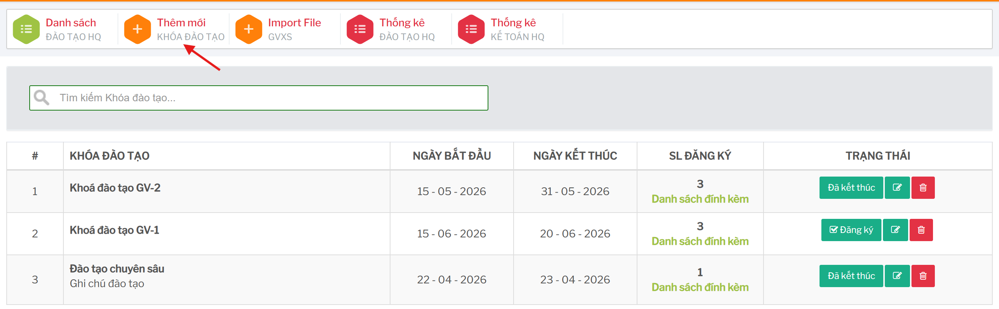
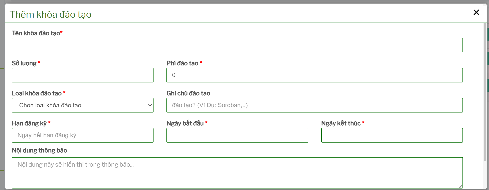
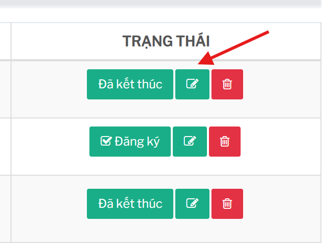
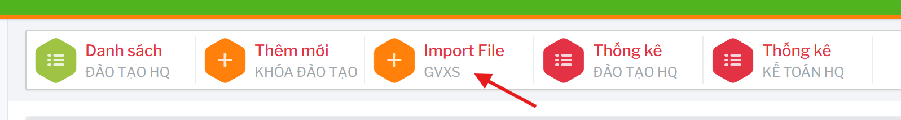

# Quản lý khóa đào tạo

## Tính năng dùng để làm gì

Tính năng này dùng để tạo mới, chỉnh sửa, xóa và theo dõi trạng thái các khóa đào tạo. Màn danh sách hiển thị tên khóa, ngày bắt đầu, ngày kết thúc, số lượng đăng ký và trạng thái.

Đường dẫn chính:

```text
Khóa đào tạo -> Danh sách
```

## Tìm kiếm khóa đào tạo

Trên màn danh sách, dùng ô tìm kiếm `Tìm kiếm Khóa đào tạo...` để lọc nhanh theo nội dung đang hiển thị trong bảng.

Việc tìm kiếm chỉ lọc dữ liệu đã tải trên màn hình. Nếu không thấy khóa cần tìm, cần kiểm tra lại quyền truy cập, trạng thái khóa hoặc dữ liệu đã được tạo hay chưa.

## Tạo khóa đào tạo mới

Từ menu trên cùng, chọn:

```text
Thêm mới -> Khóa đào tạo
```

Các thông tin quan trọng:

| Thông tin | Ý nghĩa |
| --- | --- |
| Tên khóa đào tạo | Tên hiển thị trên danh sách và trong các màn đăng ký/thanh toán. |
| Số lượng | Số lượng dự kiến hoặc giới hạn tham gia theo nghiệp vụ. |
| Phí đào tạo | Số tiền phí của khóa. Nhập `0` nếu không thu phí. |
| Loại khóa đào tạo | Chọn Finger hoặc Soroban. |
| Ghi chú đào tạo | Ghi chú nội bộ hoặc mô tả ngắn về khóa. |
| Hạn đăng ký | Thời điểm cuối cùng nên cho phép đăng ký. |
| Ngày bắt đầu | Ngày khóa đào tạo bắt đầu. |
| Ngày kết thúc | Ngày khóa đào tạo kết thúc. |
| Nội dung thông báo | Nội dung hiển thị trong thông báo liên quan đến khóa. |





Sau khi nhập đủ thông tin, bấm `Thêm khóa`.

## Sửa khóa đào tạo

Từ danh sách khóa, mở chức năng chỉnh sửa của khóa cần cập nhật. Chỉ nên sửa các thông tin như tên, ghi chú, thời gian hoặc nội dung thông báo khi chưa phát sinh nhiều đăng ký/thanh toán.

 

Cần đặc biệt cẩn trọng khi sửa:

- phí đào tạo
- hạn đăng ký
- ngày bắt đầu/ngày kết thúc
- loại khóa đào tạo
- số lượng

Nếu khóa đã có giáo viên đăng ký hoặc đã có chứng từ thanh toán, nên thống nhất với bộ phận vận hành/kế toán trước khi sửa để tránh lệch dữ liệu báo cáo.

## Xóa khóa đào tạo

Chỉ nên xóa khóa đào tạo khi:

- khóa được tạo nhầm
- chưa có hoặc không còn cần giữ danh sách đăng ký
- chưa có dữ liệu thanh toán cần đối chiếu
- chưa phát sinh kết quả đánh giá hoặc chứng nhận

Nếu khóa đã có lịch sử đăng ký, thanh toán hoặc đánh giá, nên ưu tiên ngừng sử dụng/thống nhất nghiệp vụ thay vì xóa ngay.

## Import giáo viên xuất sắc

Menu `Import File -> GVXS` dùng để nhập danh sách giáo viên xuất sắc từ file. Tính năng này thường dành cho tài khoản Head hoặc tài khoản có quyền vận hành dữ liệu đào tạo.


 
Trước khi import cần kiểm tra:

- file đúng mẫu hệ thống đang yêu cầu
- giáo viên đã có hồ sơ nhân sự phù hợp
- thông tin email, số điện thoại và cơ sở không bị sai
- tránh import trùng danh sách đã có

## Checklist trước khi lưu khóa

- Tên khóa đào tạo rõ ràng và không trùng gây nhầm lẫn.
- Loại khóa Finger/Soroban đúng.
- Phí đào tạo đã thống nhất với kế toán.
- Hạn đăng ký không muộn hơn ngày bắt đầu nếu nghiệp vụ không cho phép.
- Ngày bắt đầu và ngày kết thúc đúng thứ tự.
- Nội dung thông báo không sai ngày, phí hoặc điều kiện tham gia.
