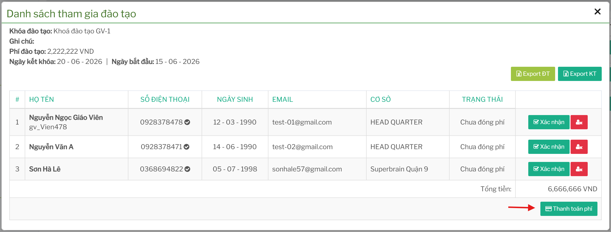
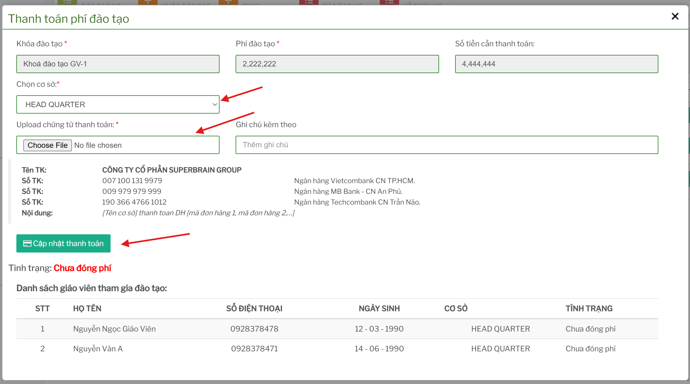

# Thanh toán phí đào tạo

## Tính năng dùng để làm gì

Tính năng thanh toán phí dùng để ghi nhận chứng từ thanh toán cho các giáo viên/nhân sự tham gia khóa đào tạo. Màn này hiển thị phí đào tạo, số lượng, số tiền cần thanh toán, ưu đãi nếu có và danh sách người tham gia theo cơ sở.

## Điều kiện trước khi thanh toán

Trước khi cập nhật thanh toán cần có:

- khóa đào tạo đã tạo
- danh sách giáo viên/nhân sự đã đăng ký
- phí đào tạo đã được cấu hình đúng
- cơ sở cần thanh toán đã được chọn đúng
- chứng từ thanh toán dạng file/hình ảnh
- ghi chú nếu cần giải thích thêm cho kế toán/Head

## Quy trình thanh toán

Từ danh sách khóa đào tạo, mở chức năng `Thanh toán phí đào tạo`.

 

Các bước thực hiện:

1. Kiểm tra tên khóa đào tạo và phí đào tạo.
2. Chọn cơ sở nếu tài khoản có quyền chọn cơ sở.
3. Kiểm tra số tiền cần thanh toán.
4. Đối chiếu danh sách giáo viên tham gia đào tạo.
5. Upload chứng từ thanh toán.
6. Nhập ghi chú nếu cần.
7. Bấm `Cập nhật thanh toán`.

Sau khi gửi thành công, hệ thống ghi nhận thanh toán và gửi thông tin đến Head để xử lý/đối chiếu.

## Các thông tin quan trọng

| Thông tin | Ý nghĩa |
| --- | --- |
| Khóa đào tạo | Khóa đang thanh toán. |
| Phí đào tạo | Phí gốc của khóa. |
| Số tiền cần thanh toán | Số tiền hệ thống tính theo số người chưa thanh toán và ưu đãi nếu có. |
| Cơ sở | Cơ sở phát sinh danh sách giáo viên cần thanh toán. |
| Chứng từ thanh toán | File/hình ảnh bắt buộc để gửi thanh toán. |
| Ghi chú | Nội dung bổ sung cho người duyệt hoặc kế toán. |
| Danh sách giáo viên | Danh sách người được tính vào lần thanh toán. |

## Lưu ý về chứng từ

Màn thanh toán yêu cầu upload chứng từ trước khi gửi. Nếu không có file chứng từ, hệ thống sẽ báo lỗi và không lưu thanh toán.

Chứng từ nên thể hiện rõ:

- ngày thanh toán
- số tiền
- tài khoản chuyển/nhận
- nội dung chuyển khoản
- thông tin cơ sở hoặc mã tham chiếu nếu có

## Khi hệ thống báo đã thanh toán đủ

Nếu số người chưa thanh toán bằng `0`, hệ thống có thể báo rằng tất cả nhân sự đã được thanh toán phí. Khi đó không cần gửi thêm chứng từ cho cùng danh sách.

Nếu thực tế còn thiếu người hoặc thiếu chứng từ, cần kiểm tra:

- đã chọn đúng cơ sở chưa
- danh sách giáo viên có bị đăng ký thiếu không
- người mới đăng ký đã được tải lại vào danh sách thanh toán chưa
- có thanh toán nào đã gửi trước đó chưa

## Xác nhận đã/chưa thanh toán

Một số màn danh sách có thao tác xác nhận nhân sự đã thanh toán phí và tạo tài khoản, hoặc chuyển lại trạng thái chưa thanh toán. Các thao tác này ảnh hưởng trực tiếp đến đối chiếu kế toán, nên chỉ thực hiện khi đã kiểm tra chứng từ và danh sách người tham gia.

## Checklist trước khi gửi thanh toán

- Đã chọn đúng khóa đào tạo.
- Đã chọn đúng cơ sở.
- Danh sách giáo viên đúng với thực tế thanh toán.
- Số tiền cần thanh toán khớp với chứng từ.
- Đã upload đúng chứng từ.
- Ghi chú đủ rõ nếu có ưu đãi, điều chỉnh hoặc thanh toán nhiều người.
