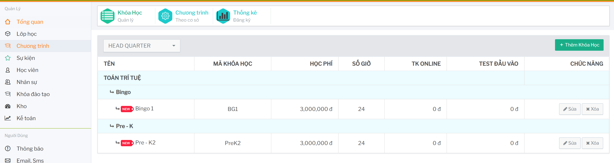
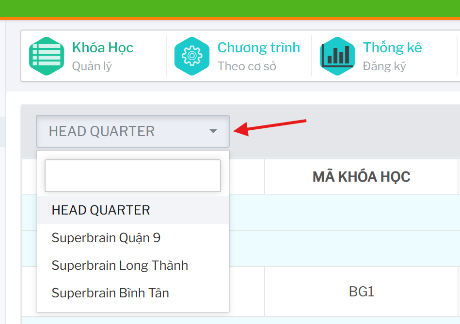
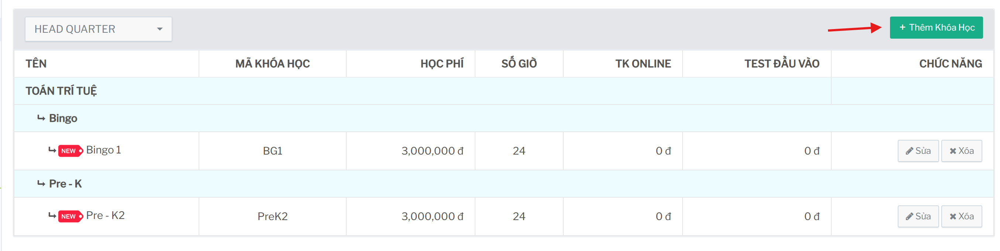
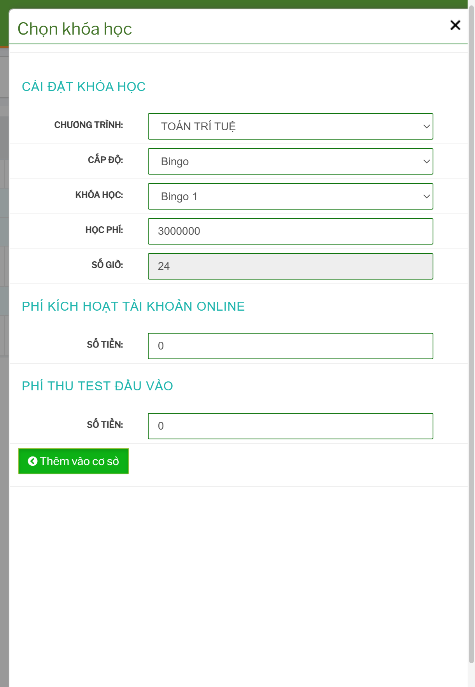

# Phân bổ khóa học theo cơ sở

## Tính năng dùng để làm gì

Tính năng này dùng để cấu hình khóa học nào được áp dụng tại từng cơ sở. Mỗi cơ sở có thể có danh sách khóa học riêng, kèm học phí, số giờ, phí tài khoản online và phí test đầu vào.

Đường dẫn chính:

```text
Khóa học -> Chương Trình Theo Cơ Sở
```



## Chọn cơ sở

Trên đầu màn hình có ô chọn cơ sở. Sau khi chọn cơ sở, hệ thống tải danh sách khóa học đang được áp dụng cho cơ sở đó.

 

Danh sách hiển thị các thông tin chính:

- tên khóa học
- mã khóa học
- học phí
- số giờ
- phí tài khoản online
- phí test đầu vào
- chức năng sửa/xóa

## Thêm khóa học vào cơ sở

Bấm `Thêm Khóa Học` trên màn chương trình theo cơ sở.

 



Các bước thao tác:

1. Chọn chương trình.
2. Chọn cấp độ.
3. Chọn khóa học.
4. Kiểm tra học phí và số giờ.
5. Nhập phí kích hoạt tài khoản online nếu có.
6. Nhập phí thu test đầu vào nếu có.
7. Bấm `Thêm vào cơ sở`.

Nếu không chọn được khóa học, cần kiểm tra chương trình/cấp độ đã đúng chưa hoặc khóa học đã được phân bổ vào cơ sở này trước đó chưa.

## Sửa cấu hình khóa học tại cơ sở

Trên dòng khóa học của cơ sở, mở thao tác sửa/cập nhật.


Có thể cập nhật:

- số giờ
- học phí
- phí tài khoản online
- phí test đầu vào

Hệ thống có kiểm tra học phí không được thấp hơn học phí cơ bản. Nếu nhập thấp hơn mức cơ bản, hệ thống sẽ báo lỗi và đưa học phí về giá tối thiểu.

## Xóa khóa học khỏi cơ sở

Chỉ nên xóa khóa khỏi cơ sở khi cơ sở không còn sử dụng khóa đó và chưa có dữ liệu đăng ký đang phụ thuộc.

Trước khi xóa cần kiểm tra:

- cơ sở có học viên đang đăng ký khóa đó không
- khóa có đang mở lớp không
- khóa có trong báo cáo hoặc công nợ cần đối chiếu không
- có cần giữ lịch sử thay vì xóa khỏi danh sách hay không

## Checklist trước khi phân bổ

- Đã chọn đúng cơ sở.
- Chương trình, cấp độ và khóa học đúng.
- Học phí không thấp hơn học phí cơ bản.
- Số giờ đúng với cấu hình đào tạo.
- Phí online và phí test đúng chính sách của cơ sở.
- Không thêm trùng khóa đã có ở cơ sở.
