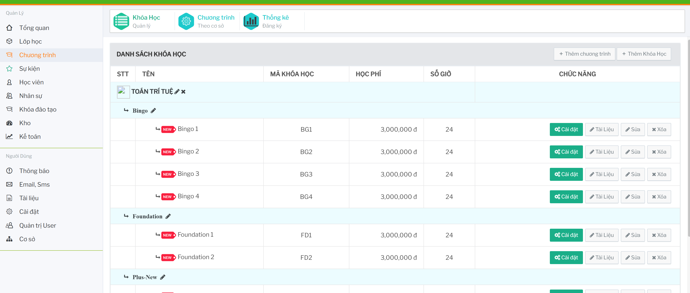
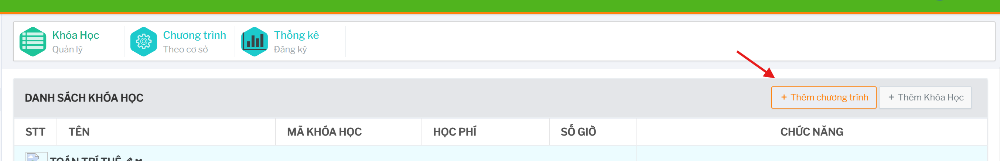
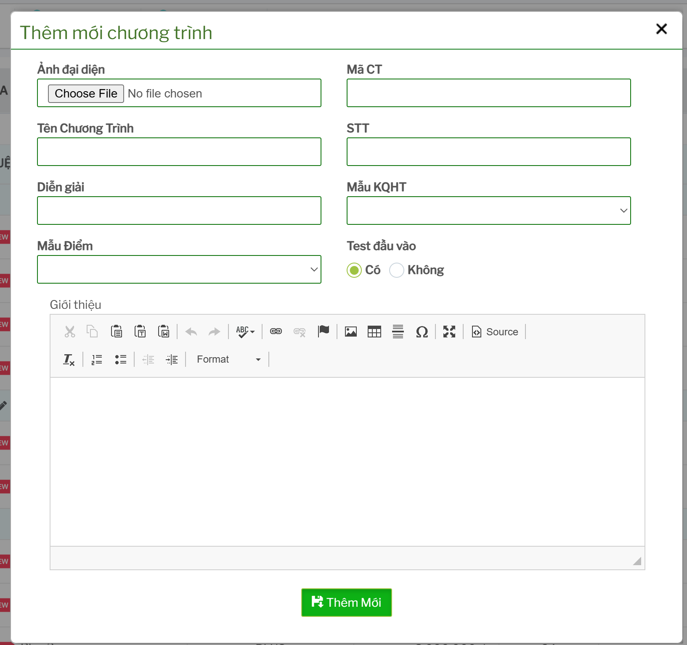
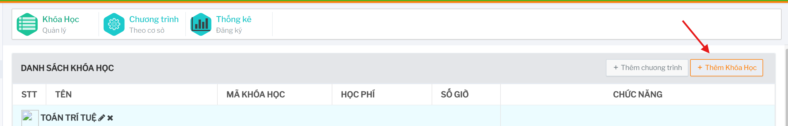
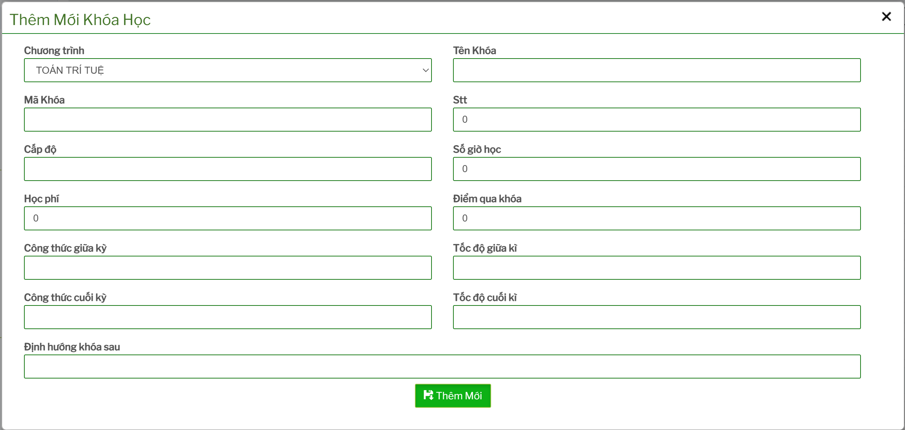
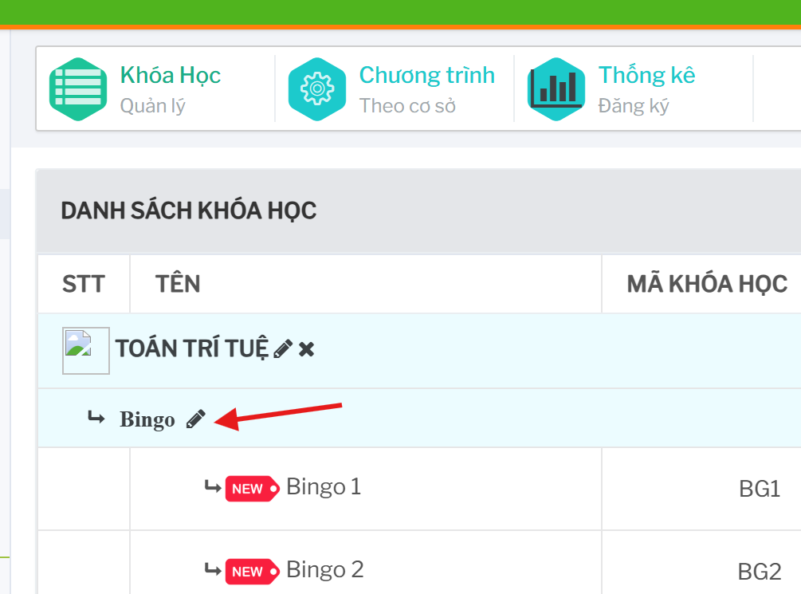
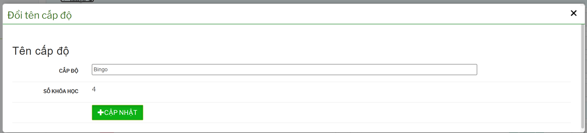
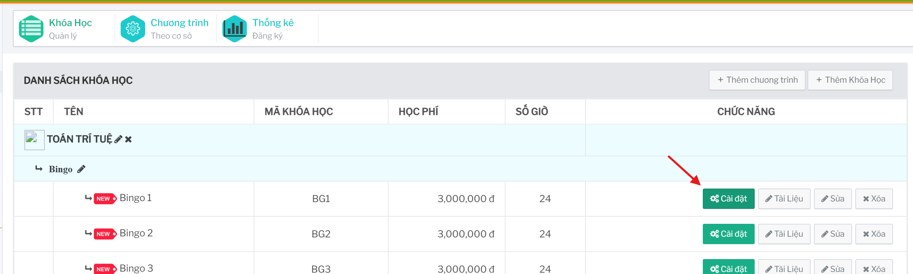
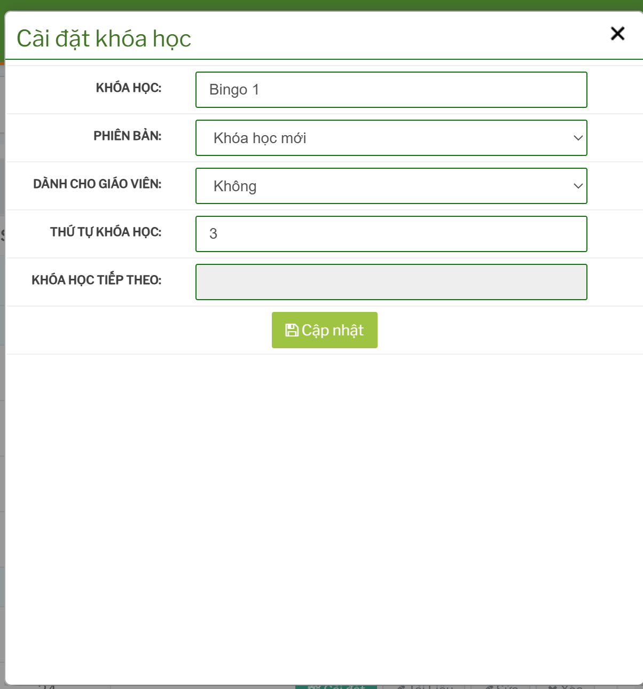

# Quản lý chương trình và khóa học

## Tính năng dùng để làm gì

Tính năng này dùng để quản lý danh mục chương trình và khóa học. Đây là nơi tạo chương trình cha, tạo khóa học con, đặt cấp độ, mã khóa học, học phí, số giờ và các cấu hình hiển thị của khóa.

Đường dẫn chính:

```text
Khóa học -> Chương Trình, Khóa Học
```

 

## Cấu trúc dữ liệu cần hiểu

Danh mục khóa học được tổ chức theo dạng:

```text
Chương trình
  -> Cấp độ
      -> Khóa học
```

Ví dụ: một chương trình có nhiều cấp độ, mỗi cấp độ có một hoặc nhiều khóa học. Khi sửa cấp độ hoặc khóa học, dữ liệu có thể ảnh hưởng đến đăng ký học viên, xếp lớp, thu học phí và báo cáo.

## Thêm chương trình

Trên màn danh sách, bấm `Thêm chương trình`.

 



Sau khi nhập thông tin, lưu lại để chương trình xuất hiện trong danh sách. Chương trình mới cần được kiểm tra trước khi dùng để tạo khóa học hoặc mở đăng ký.

## Thêm khóa học

Trên màn danh sách, bấm `Thêm Khóa Học`.



 

Các thông tin quan trọng thường cần kiểm tra:

- chương trình cha
- cấp độ
- tên khóa học
- mã khóa học
- học phí cơ bản
- số giờ/số buổi
- trạng thái hiển thị
- tài liệu hoặc file upload nếu form có yêu cầu

## Sửa chương trình hoặc khóa học

Trên danh sách:

- bấm biểu tượng bút cạnh tên chương trình để sửa chương trình
- bấm `Sửa` trên dòng khóa học để sửa khóa học

Chỉ nên sửa học phí, số giờ hoặc cấp độ sau khi đã kiểm tra dữ liệu đăng ký hiện có. Nếu khóa đã được học viên đăng ký, thay đổi dữ liệu nền có thể làm lệch học phí, thống kê hoặc cách xếp lớp.

## Đổi tên cấp độ

Trên danh sách, bấm vào tên cấp độ hoặc biểu tượng sửa cạnh cấp độ để mở form đổi tên.





Thao tác này cập nhật hàng loạt các khóa học cùng cấp độ trong cùng chương trình. Cần kiểm tra kỹ tên cũ, tên mới và số khóa học bị ảnh hưởng trước khi bấm `CẬP NHẬT`.

## Cài đặt khóa học

Một số tài khoản có quyền sẽ thấy nút `Cài đặt` trên dòng khóa học.





Màn này dùng để chỉnh: 

- phiên bản khóa học
- khóa học dành cho giáo viên/người hướng dẫn hay không
- thứ tự hiển thị
- khóa học tiếp theo nếu có

## Xóa chương trình hoặc khóa học

Chỉ nên xóa khi dữ liệu tạo nhầm và chưa phát sinh đăng ký. Với khóa học đã có đăng ký, hệ thống có thể chuyển sang trạng thái không còn hiệu lực thay vì xóa hẳn.

Trước khi xóa cần kiểm tra:

- khóa đã có học viên đăng ký chưa
- khóa đã được phân bổ về cơ sở chưa
- khóa có đang dùng trong lớp học, học phí, sự kiện hoặc báo cáo không
- chương trình có còn khóa học con không

## Checklist trước khi lưu

- Tên chương trình/khóa học rõ ràng.
- Mã khóa học không trùng gây nhầm lẫn.
- Học phí và số giờ đúng.
- Cấp độ đúng với chương trình.
- Không sửa cấp độ/học phí nếu chưa kiểm tra đăng ký đang dùng.
- Nếu khóa cần dùng tại cơ sở, đã phân bổ khóa sang cơ sở sau khi tạo.
