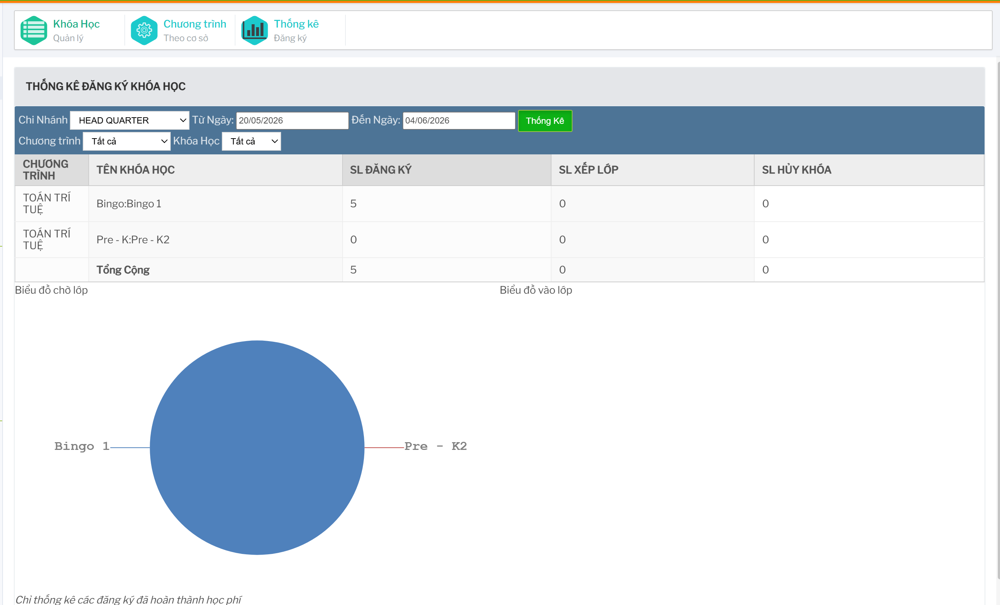

# Thống kê đăng ký khóa học

## Tính năng dùng để làm gì

Tính năng này dùng để thống kê số lượng học viên đăng ký khóa học theo chi nhánh, chương trình, khóa học và khoảng thời gian.

Đường dẫn chính:

```text
Khóa học -> Thống kê đăng ký
```



## Bộ lọc thống kê

Người dùng có thể lọc theo:

- chi nhánh
- từ ngày
- đến ngày
- chương trình
- khóa học

Khi đổi chi nhánh, hệ thống tải lại danh sách chương trình. Khi đổi chương trình, hệ thống tải lại danh sách khóa học tương ứng.

## Cách xem thống kê

Các bước thao tác:

1. Chọn chi nhánh.
2. Chọn khoảng ngày `Từ Ngày` và `Đến Ngày`.
3. Chọn chương trình.
4. Chọn khóa học hoặc để toàn bộ nếu cần xem theo nhiều khóa.
5. Bấm `Thống Kê`.


## Các chỉ số trên bảng

| Chỉ số | Ý nghĩa |
| --- | --- |
| SL đăng ký | Số đăng ký đã hoàn thành học phí và đang ở trạng thái chờ/xử lý đăng ký. |
| SL xếp lớp | Số học viên đã được đưa vào lớp. |
| SL hủy khóa | Số đăng ký bị hủy trong khoảng lọc. |

Màn thống kê có ghi chú: chỉ thống kê các đăng ký đã hoàn thành học phí.

## Biểu đồ

Sau khi thống kê, hệ thống hiển thị:

- biểu đồ chờ lớp
- biểu đồ vào lớp

Biểu đồ giúp nhìn nhanh tỷ lệ giữa các khóa/chương trình, nhưng khi đối chiếu vận hành nên dùng cả bảng số liệu.

## Checklist khi đối chiếu số liệu

- Chọn đúng chi nhánh.
- Khoảng ngày đúng với kỳ cần xem.
- Chọn đúng chương trình/khóa học.
- Nhớ rằng thống kê chỉ tính đăng ký đã hoàn thành học phí.
- Nếu số liệu lệch, kiểm tra thêm module học viên, đăng ký, xếp lớp và kế toán.
