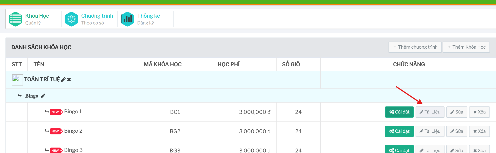
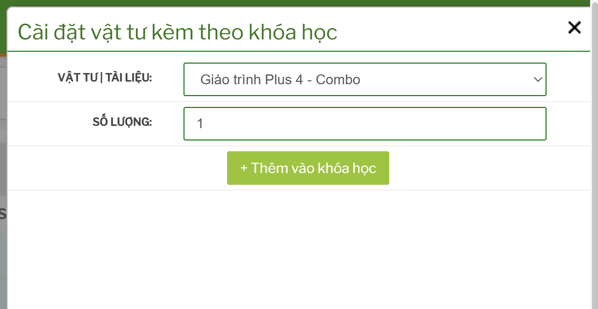

# Vật tư và tài liệu đi kèm khóa học

## Tính năng dùng để làm gì

Tính năng này dùng để gắn vật tư hoặc tài liệu đi kèm một khóa học. Các vật tư/tài liệu này có thể được dùng trong quy trình đăng ký, chuẩn bị học liệu hoặc vận hành kho.

## Mở màn vật tư/tài liệu

Từ danh sách chương trình và khóa học, bấm nút `Tài Liệu` trên dòng khóa học cần thao tác.

## Thêm vật tư/tài liệu vào khóa học

Các bước thao tác: 

1. Chọn vật tư hoặc tài liệu trong danh sách.
2. Nhập số lượng.
3. Bấm `+ Thêm vào khóa học`.
4. Kiểm tra danh sách vật tư/tài liệu đã thêm bên dưới.

Nếu vật tư/tài liệu không hiển thị trong danh sách chọn, cần kiểm tra danh mục vật tư/kho hoặc quyền truy cập dữ liệu.

## Xóa vật tư/tài liệu khỏi khóa học

Trong danh sách vật tư/tài liệu đã gắn, dùng thao tác xóa của dòng cần bỏ. Chỉ nên xóa khi vật tư/tài liệu đó không còn áp dụng cho khóa học.

Trước khi xóa cần kiểm tra:

- khóa học có đang dùng trong đăng ký mới không
- vật tư/tài liệu đã được tính trong đơn hàng hoặc phiếu kho chưa
- có cần giữ lại để đối chiếu lịch sử hay không

## Lưu ý vận hành

Không nên thay đổi vật tư/tài liệu của khóa học khi khóa đang được đăng ký hàng loạt mà chưa thông báo cho bộ phận kho/vận hành. Việc thay đổi có thể làm lệch danh sách chuẩn bị học liệu hoặc số lượng vật tư cần xuất.

## Checklist trước khi lưu

- Đã chọn đúng khóa học.
- Vật tư/tài liệu đúng.
- Số lượng đúng.
- Không thêm trùng vật tư/tài liệu.
- Đã kiểm tra ảnh hưởng đến kho hoặc đơn hàng nếu có.
