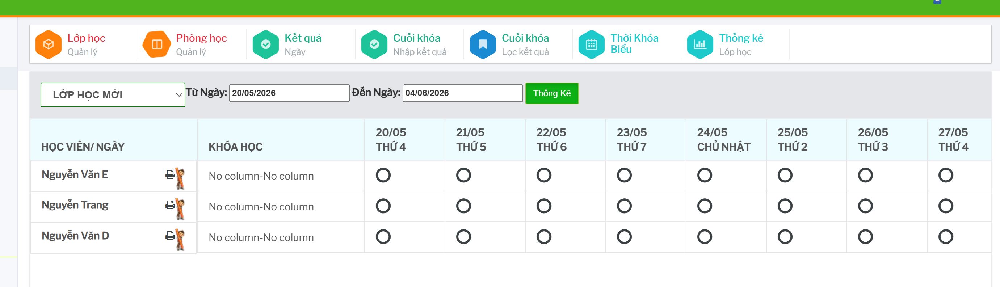

# Điểm danh, kết quả theo ngày

Màn `Kết quả / Ngày` dùng để theo dõi và nhập kết quả học tập theo từng ngày học của học viên trong lớp.

## Lọc dữ liệu cần nhập

Chọn lớp tại ô danh sách lớp, nhập `Từ Ngày`, `Đến Ngày`, sau đó bấm `Thống Kê`.

Hệ thống tải danh sách học viên và trạng thái nhập kết quả theo từng ngày trong khoảng đã chọn.

## Hiểu trạng thái điểm danh

Khu vực chú thích trên màn hình cho biết ý nghĩa từng trạng thái:

- Dấu tick màu xanh: `Đã nhập`.
- Vòng tròn rỗng: `Chưa nhập`.
- Dấu tick màu đỏ: `Vắng`.

## Nhập hoặc sửa kết quả theo ngày

Tại dòng học viên và cột ngày cần thao tác, bấm vào ô trạng thái tương ứng.

Hệ thống mở form `Kết quả học tập ngày`. Nhập thông tin điểm danh hoặc kết quả học tập rồi lưu lại.

Sau khi lưu, quay lại màn thống kê ngày để kiểm tra trạng thái đã được cập nhật đúng.

## In điểm danh

Nếu màn hình có chức năng in điểm danh cho lớp hoặc ngày học, kiểm tra lại lớp và khoảng ngày trước khi in để tránh in nhầm dữ liệu.
