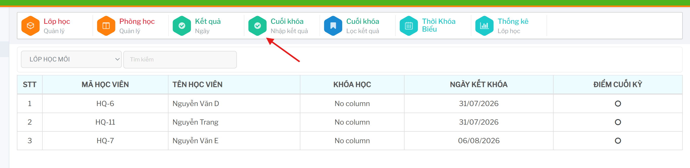
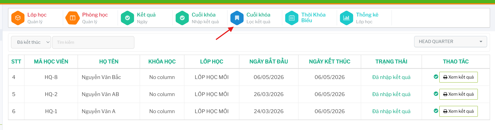
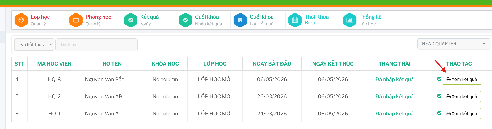

# Kết quả cuối khóa

Nhóm chức năng cuối khóa dùng để nhập điểm, nhận xét, in bảng điểm, gửi email kết quả và lọc lại danh sách học viên theo trạng thái.

## Nhập kết quả cuối khóa

Vào `Cuối khóa / Nhập kết quả`.

Chọn lớp tại ô danh sách lớp hoặc nhập từ khóa vào ô `Tìm kiếm` để tìm học viên.

Trên dòng học viên cần cập nhật, bấm chức năng nhập hoặc sửa kết quả cuối khóa.

  

Hệ thống mở form `Kết quả cuối khóa`. Nhập điểm, nhận xét, định hướng khóa tiếp theo và các thông tin đánh giá liên quan rồi lưu lại.

## In bảng điểm

Trên dòng học viên cần in, bấm chức năng in bảng điểm.

Hệ thống mở mẫu in bảng điểm theo học viên và loại kết quả đang thao tác.

## Gửi email kết quả

Trên dòng học viên cần gửi, bấm chức năng gửi email kết quả.

Chỉ gửi email sau khi đã kiểm tra điểm, nhận xét và thông tin người nhận.

## Lọc kết quả cuối khóa

Vào `Cuối khóa / Lọc kết quả` để tra cứu học viên theo trạng thái khóa học.

Có thể chọn trạng thái `Đang học` hoặc `Đã kết thúc`, nhập từ khóa tìm kiếm và chọn chi nhánh.

Bảng kết quả hiển thị mã học viên, họ tên, khóa học, lớp học, ngày bắt đầu, ngày kết thúc, trạng thái và thao tác liên quan.
