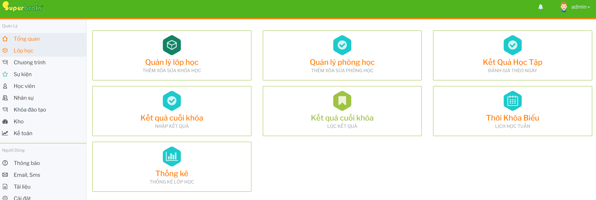

# Lưu ý vận hành module Lớp học

## Trước khi tạo lớp

- Kiểm tra chương trình, khóa học và danh sách học viên đã được chuẩn bị đầy đủ.
- Kiểm tra chi nhánh thao tác để lớp được tạo đúng cơ sở.
- Nếu lớp cần lịch học cố định, nên chuẩn bị trước giáo viên, phòng học và khung giờ. 

## Khi xếp thời khóa biểu

- Không xếp trùng phòng học, giáo viên hoặc khung giờ nếu hệ thống chưa cảnh báo tự động.
- Sau khi tạo lớp bằng nút `Tạo Thời Khóa Biểu`, cần kiểm tra lại từng ngày học trước khi lưu.
- Với lớp thay đổi lịch, nên cập nhật thời khóa biểu trước khi nhập kết quả theo ngày.

## Khi nhập kết quả theo ngày

- Luôn chọn đúng lớp và khoảng ngày trước khi bấm `Thống Kê`.
- Kiểm tra chú thích trạng thái để phân biệt `Đã nhập`, `Chưa nhập` và `Vắng`.
- Nếu sửa dữ liệu đã nhập trước đó, cần quay lại bảng ngày để kiểm tra trạng thái sau khi lưu.

## Khi nhập kết quả cuối khóa

- Chỉ nhập kết quả cuối khóa khi dữ liệu điểm danh và kết quả theo ngày đã được rà soát.
- Trước khi in bảng điểm hoặc gửi email, cần kiểm tra điểm, nhận xét và định hướng khóa tiếp theo.
- Dùng màn `Cuối khóa / Lọc kết quả` để đối soát học viên đang học và đã kết thúc.

## Khi báo cáo thống kê

- Chọn đúng chi nhánh trước khi xuất Excel.
- Chú ý nhóm `Gần kết thúc (14 ngày)` để chuẩn bị nhập kết quả cuối khóa, in bảng điểm hoặc tư vấn khóa tiếp theo.
