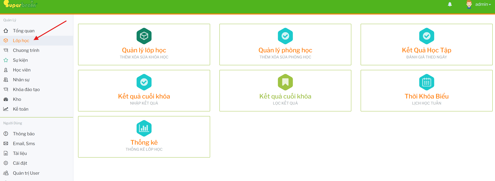

# Tổng quan module Lớp học

Module `Lớp học` dùng để quản lý lớp sau khi học viên đã đăng ký khóa học: tạo lớp, xếp thời khóa biểu, quản lý phòng học, nhập kết quả học tập theo ngày, nhập kết quả cuối khóa và theo dõi thống kê lớp.

## Nhóm chức năng chính

- `Lớp học / Quản lý`: tạo mới, chỉnh sửa lớp, cập nhật thời khóa biểu, xem học viên trong lớp và xuất danh sách lớp.
- `Phòng học / Quản lý`: quản lý danh mục phòng học dùng khi xếp lịch lớp.
- `Kết quả / Ngày`: điểm danh hoặc nhập kết quả học tập theo từng ngày học.
- `Cuối khóa / Nhập kết quả`: nhập kết quả cuối khóa cho từng học viên trong lớp.
- `Cuối khóa / Lọc kết quả`: lọc học viên theo trạng thái khóa học và kết quả cuối khóa.
- `Thời Khóa Biểu`: xem lịch học theo khoảng thời gian.
- `Thống kê / Lớp học`: theo dõi sĩ số đang học, đã kết thúc và lớp gần kết thúc.

## Luồng vận hành đề xuất

1. Vào `Lớp học / Quản lý` để tạo lớp học.
2. Cập nhật thời khóa biểu cho lớp, chọn giáo viên và phòng học theo từng buổi.
3. Kiểm tra danh sách học viên trong lớp.
4. Trong quá trình học, vào `Kết quả / Ngày` để nhập kết quả hoặc trạng thái theo ngày.
5. Khi khóa học kết thúc, vào `Cuối khóa / Nhập kết quả` để nhập điểm và nhận xét cuối khóa.
6. Dùng `Thời Khóa Biểu`, `Cuối khóa / Lọc kết quả` và `Thống kê / Lớp học` để tra cứu, đối soát và báo cáo.

## Liên kết tài liệu

- [Quản lý lớp học](QuanLyLopHoc.md)
- [Phòng học và thời khóa biểu](PhongHocThoiKhoaBieu.md)
- [Điểm danh, kết quả theo ngày](DiemDanhKetQuaNgay.md)
- [Kết quả cuối khóa](KetQuaCuoiKhoa.md)
- [Thống kê lớp học](ThongKeLopHoc.md)
- [Lưu ý vận hành](LuuYVanHanh.md)
 