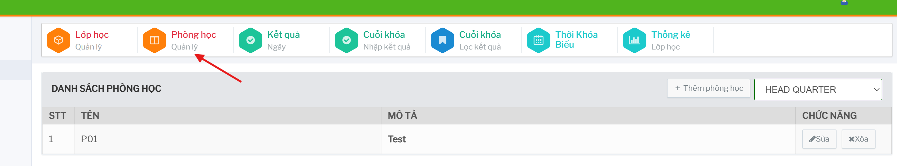
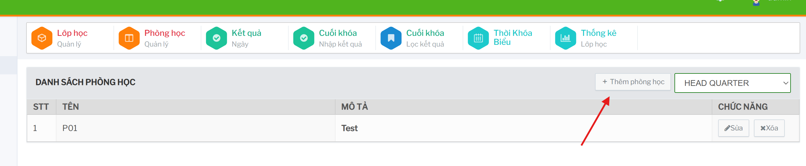
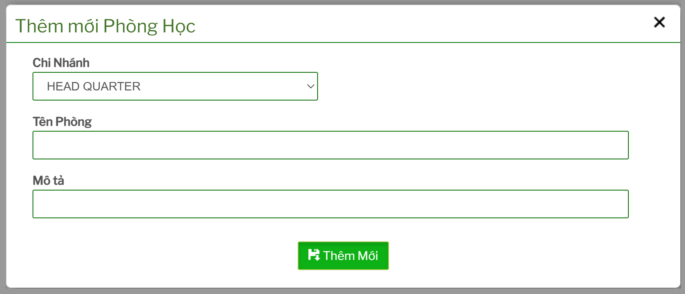
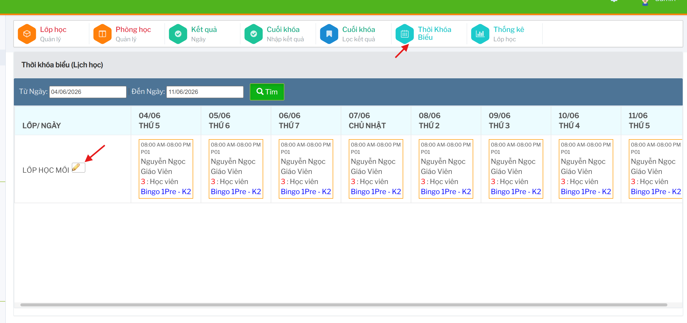

# Phòng học và thời khóa biểu

Nhóm chức năng này dùng để quản lý phòng học và xếp lịch học cho từng lớp.

## Quản lý phòng học

Vào `Phòng học / Quản lý` để xem danh sách phòng học.

Bảng phòng học gồm: 

- `Tên`: tên phòng học.
- `Mô tả`: thông tin mô tả hoặc ghi chú.
- `Chức năng`: thao tác sửa thông tin phòng học.

### Thêm phòng học

Tại màn danh sách phòng học, bấm `Thêm phòng học`.

Nhập thông tin phòng học trên form, sau đó bấm `Thêm mới` để lưu.

### Sửa phòng học 

Trên dòng phòng học cần cập nhật, bấm nút sửa trong cột `Chức năng`.

Cập nhật thông tin phòng học trên form rồi lưu lại.

## Cập nhật thời khóa biểu cho lớp

Từ màn `Lớp học / Quản lý`, trên dòng lớp cần xếp lịch, bấm chức năng cập nhật thời khóa biểu.

Form thời khóa biểu cho phép bật/tắt buổi học theo từng ngày, nhập giờ bắt đầu, giờ kết thúc, giáo viên và phòng học.

Sau khi kiểm tra lịch, bấm `Cập Nhật Thời Khóa Biểu` để lưu.

## Xem thời khóa biểu

Vào `Thời Khóa Biểu` để tra cứu lịch học theo khoảng thời gian.

Chọn `Từ Ngày`, `Đến Ngày`, sau đó bấm `Tìm`.

Khi đối chiếu lịch, cần kiểm tra đồng thời lớp học, giáo viên, phòng học và khoảng giờ để tránh trùng lịch vận hành.
