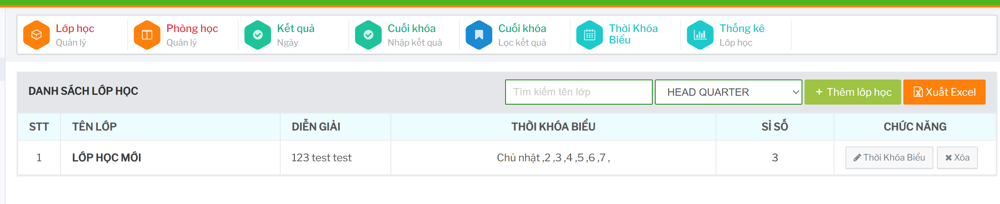
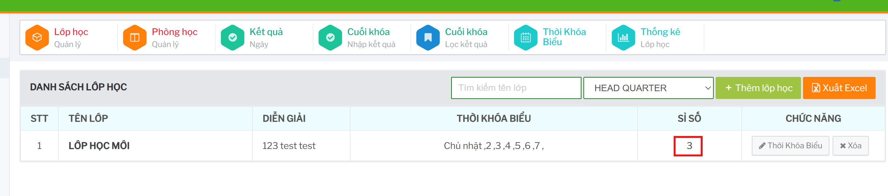
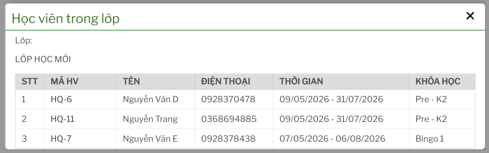

# Quản lý lớp học

Màn `Lớp học / Quản lý` hiển thị danh sách lớp học và các thao tác chính trên từng lớp.

  

## Tra cứu danh sách lớp

Tại màn danh sách, người dùng có thể nhập tên lớp vào ô `Tìm kiếm tên lớp` hoặc chọn chi nhánh để thu hẹp danh sách.

Bảng danh sách gồm các thông tin chính:

- `Tên Lớp`: tên lớp học.
- `Diễn Giải`: ghi chú hoặc mô tả lớp.
- `Thời khóa biểu`: thông tin lịch học đã thiết lập cho lớp.
- `Sỉ số`: số lượng học viên trong lớp.
- `Chức năng`: các thao tác như sửa lớp, cập nhật thời khóa biểu, xem học viên trong lớp.

## Thêm lớp học

Từ màn danh sách lớp học, bấm nút `Thêm lớp học`.

Hệ thống mở form `Thêm mới lớp học`. Nhập thông tin lớp, sau đó chọn:

- `Thêm mới`: lưu thông tin lớp.
- `Tạo Thời Khóa Biểu`: lưu lớp và chuyển tiếp sang form cập nhật thời khóa biểu.

## Sửa lớp học

Trên dòng lớp cần cập nhật, bấm nút sửa trong cột `Chức năng`.

Hệ thống mở form `Sửa thông tin lớp học`. Cập nhật thông tin cần thay đổi rồi lưu lại.

## Xem học viên trong lớp

Trên dòng lớp cần kiểm tra, bấm chức năng xem học viên trong lớp.

 

Modal `Học viên trong lớp` hiển thị danh sách học viên kèm mã học viên, tên, điện thoại, thời gian và khóa học.

## Xuất Excel

Bấm `Xuất Excel` trên màn danh sách để xuất dữ liệu lớp học đang hiển thị. Trước khi xuất nên chọn đúng chi nhánh hoặc từ khóa tìm kiếm để file xuất ra đúng phạm vi cần dùng. 
