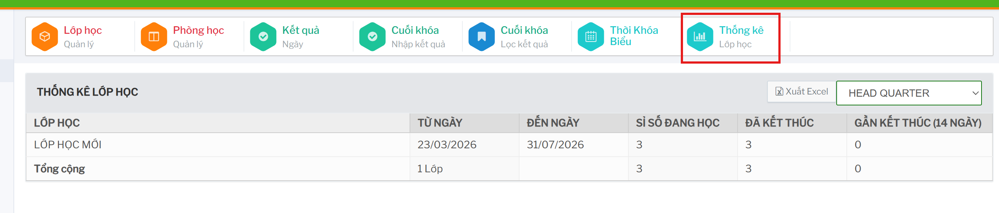

# Thống kê lớp học

Màn `Thống kê / Lớp học` dùng để theo dõi tình trạng vận hành của các lớp theo chi nhánh.

## Cách xem thống kê

1. Vào `Thống kê / Lớp học`.
2. Chọn chi nhánh cần xem.
3. Hệ thống tải dữ liệu thống kê lớp học tương ứng.

Bảng thống kê gồm các cột chính:

- `Lớp Học`: tên lớp.
- `Từ Ngày`: ngày bắt đầu.
- `Đến Ngày`: ngày kết thúc.
- `Sỉ số đang học`: số học viên đang theo học.
- `Đã kết thúc`: số hoặc trạng thái lớp đã kết thúc.
- `Gần kết thúc (14 ngày)`: lớp sắp kết thúc trong khoảng 14 ngày.

## Xuất Excel

Bấm `Xuất Excel` để tải bảng thống kê đang hiển thị. Trước khi xuất cần chọn đúng chi nhánh để dữ liệu báo cáo không bị lẫn giữa các cơ sở.
