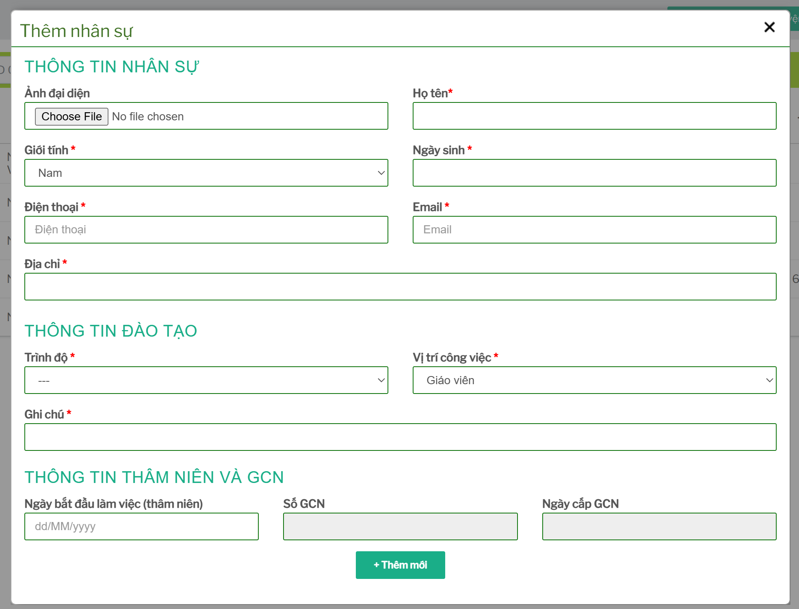
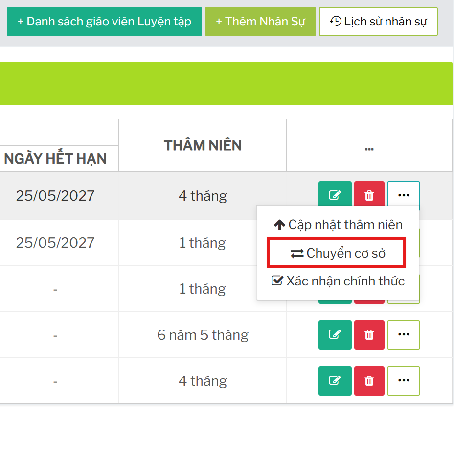

# Quản lý danh sách nhân sự

## Mở danh sách nhân sự

Từ menu bên trái, bấm `Nhân sự`, sau đó bấm thẻ `Danh sách nhân sự`.

Màn hình danh sách có bộ lọc chi nhánh, trạng thái nhân sự, vị trí công việc, ô tìm kiếm và bảng nhân sự.

## Lọc và tìm kiếm

Sử dụng các bộ lọc phía trên bảng:

- Chọn chi nhánh.
- Chọn `Chính thức` hoặc `Thử việc`.
- Chọn vị trí công việc hoặc `Tất cả vị trí`.
- Nhập tên nhân sự vào ô `Tìm kiếm`.

Danh sách tự tải lại sau khi đổi bộ lọc hoặc nhập tìm kiếm.

## Thêm nhân sự

Trên màn danh sách, bấm `+ Thêm Nhân Sự`.

Modal `Thêm nhân sự` mở ra.

Nhập các nhóm thông tin đang hiển thị:

- `Thông tin nhân sự`
- `Thông tin đào tạo`
- `Thông tin thâm niên và GCN`

Bấm `+ Thêm mới` để lưu.

## Sửa nhân sự

Tại dòng nhân sự cần cập nhật, bấm nút biểu tượng bút chì.

Modal `Sửa nhân sự` mở ra.

Cập nhật thông tin cần thay đổi, sau đó bấm nút lưu trên form.

## Xóa nhân sự

Tại dòng nhân sự cần xóa, bấm nút biểu tượng thùng rác.

Hệ thống hiển thị hộp thoại xác nhận.

Chỉ xác nhận khi chắc chắn không còn cần dùng hồ sơ nhân sự đó.

## Cập nhật thâm niên và GCN

Tại dòng nhân sự cần cập nhật, bấm nút dấu ba chấm, sau đó chọn `Cập nhật thâm niên`.

Modal `Cập nhật thâm niên` mở ra.

Cập nhật số GCN, ngày cấp, ngày bắt đầu làm việc hoặc trạng thái cập nhật thâm niên, sau đó bấm `Cập nhật`.

## Chuyển cơ sở nhân sự

Tại dòng nhân sự cần chuyển, bấm nút dấu ba chấm, sau đó chọn `Chuyển cơ sở`.

Modal `Chuyển cơ sở nhân sự` mở ra.

Chọn nhân sự thay thế nếu cần, chọn cơ sở đến, cấp bậc và nhập ghi chú, sau đó bấm `Cập Nhật`.

## Xác nhận nhân sự chính thức

Nếu tài khoản hiện tại có quyền và dòng nhân sự đang cần xác nhận, trong menu dấu ba chấm sẽ có mục `Xác nhận chính thức`.

Bấm mục này và xác nhận trên hộp thoại để chuyển nhân sự sang trạng thái chính thức.

## Mở lịch sử nhân sự

Trên màn danh sách, bấm `Lịch sử nhân sự` để mở màn lịch sử thao tác của module nhân sự.
