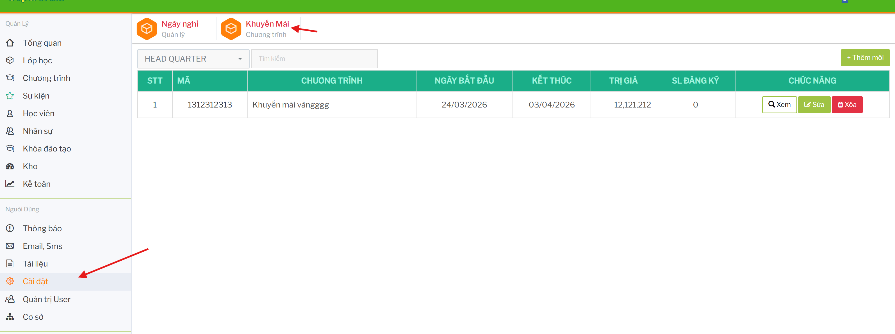

# Cài đặt khuyến mãi

## Mở màn Khuyến Mãi

Từ menu bên trái, bấm `Cài đặt`, sau đó bấm thẻ `Ưu Đãi` hoặc chọn `Khuyến Mãi` trên thanh chức năng.

Màn hình `Khuyến Mãi` hiển thị bộ lọc chi nhánh, ô tìm kiếm, nút `Thêm mới` và bảng danh sách chương trình khuyến mãi.

## Lọc và tìm kiếm 

- Chọn chi nhánh để xem chương trình khuyến mãi của chi nhánh đó.
- Nhập mã khuyến mãi vào ô `Tìm kiếm` để lọc danh sách.

## Thêm chương trình khuyến mãi

Trên màn `Khuyến Mãi`, bấm `+ Thêm mới`.

Modal `Thêm mới khuyến mãi` mở ra.

Nhập:

- `Mã`
- `Từ ngày`
- `Đến ngày`
- `Giá trị`
- `Nội dung`

Trường `Giá trị` chỉ nhập số. Bấm `THÊM MỚI` để lưu.

## Xem danh sách đăng ký theo khuyến mãi

Tại dòng chương trình cần kiểm tra, bấm `Xem` ở cột `Chức năng`.

Modal `Danh sách đăng ký` mở ra và hiển thị học viên/đăng ký đang dùng chương trình đó.

## Sửa chương trình khuyến mãi

Tại dòng chương trình cần sửa, bấm `Sửa`.

Modal `Sửa thông tin khuyến mãi` mở ra.

Cập nhật thông tin cần thay đổi, sau đó bấm `CẬP NHẬT`.

## Xóa chương trình khuyến mãi

Tại dòng chương trình cần xóa, bấm `Xóa`.

Hệ thống hiển thị hộp thoại xác nhận.

Xác nhận để xóa chương trình khỏi danh sách đang sử dụng.
