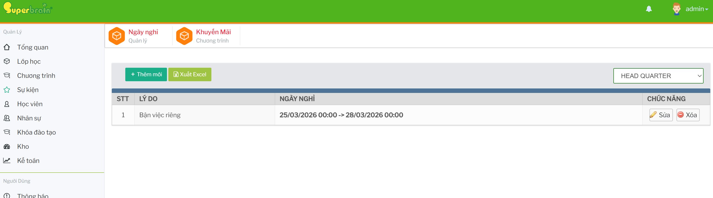

# Cài đặt ngày nghỉ

## Mở màn Ngày nghỉ

Từ menu bên trái, bấm `Cài đặt`, sau đó bấm thẻ `Ngày nghỉ`.

Màn hình `Ngày nghỉ` hiển thị bộ lọc chi nhánh, nút `Thêm mới`, nút `Xuất Excel` và bảng danh sách ngày nghỉ.

## Lọc danh sách theo chi nhánh 

Chọn chi nhánh trong ô chọn ở góc phải màn hình. Danh sách ngày nghỉ sẽ tải lại theo chi nhánh đã chọn.

## Thêm ngày nghỉ

Trên màn `Ngày nghỉ`, bấm `Thêm mới`.

Modal `Cập nhật lịch Nghỉ` mở ra.

Nhập:

- `Từ ngày`
- `Đến ngày`
- `Lý do`

Bấm `Cập nhật` để lưu.

## Sửa ngày nghỉ

Tại dòng ngày nghỉ cần sửa, bấm `Sửa` nếu nút này đang hiển thị với tài khoản hiện tại.

Modal `Sửa ngày nghỉ` mở ra.

Cập nhật khoảng ngày hoặc lý do, sau đó bấm `Cập nhật`.

## Xóa ngày nghỉ

Tại dòng ngày nghỉ cần xóa, bấm `Xóa`.

Hệ thống hiển thị hộp thoại xác nhận.

Xác nhận để xóa. Hệ thống chỉ xóa được lịch nghỉ chưa diễn ra; nếu ngày nghỉ đã diễn ra, hệ thống báo không thể xóa.

## Xuất Excel

Bấm `Xuất Excel` để tải danh sách lịch nghỉ đang hiển thị ra file Excel.
