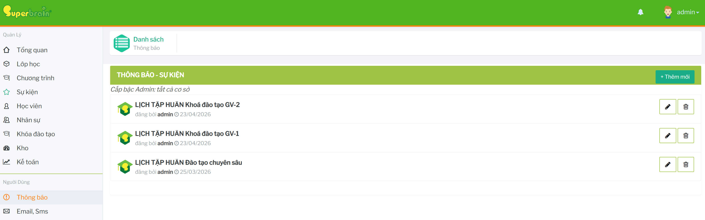

# Thông báo

Module `Thông báo` dùng để xem và quản lý các thông báo/sự kiện nội bộ gửi đến chi nhánh.

## Cách truy cập

Từ menu bên trái, bấm `Thông báo`.

Hệ thống mở màn `Thông báo - sự kiện`.

## Luồng sử dụng chính

- [Quản lý thông báo](./QuanLyThongBao.md)
- [Lưu ý vận hành](./LuuYVanHanh.md)

## Phạm vi hiển thị 

Tài khoản cấp admin có thể xem thông báo của tất cả cơ sở. Tài khoản cơ sở nhìn thấy thông báo được gửi đến chi nhánh của mình hoặc thông báo do chính tài khoản đó tạo.
